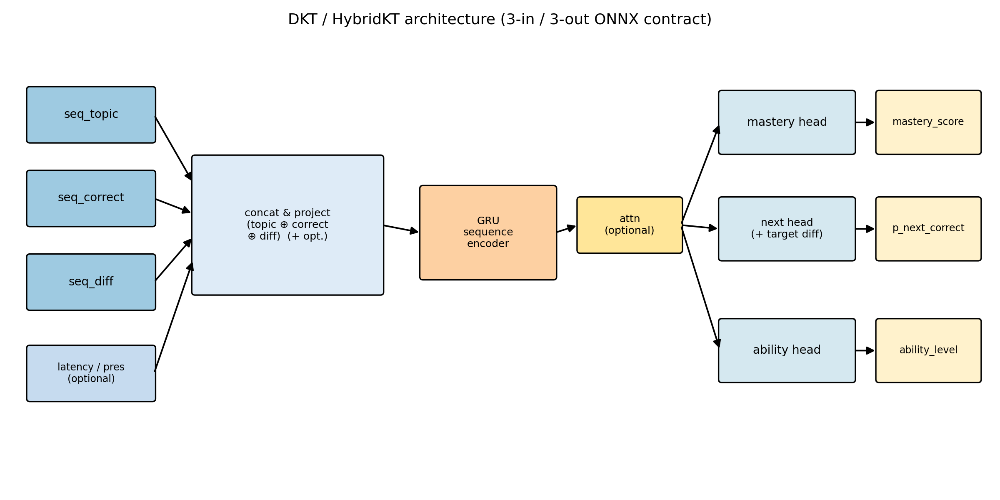
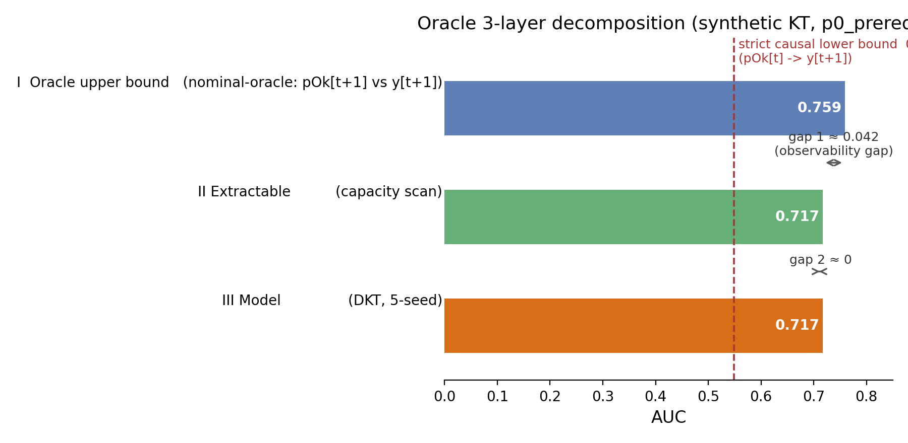
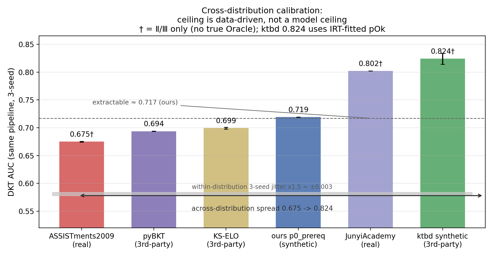
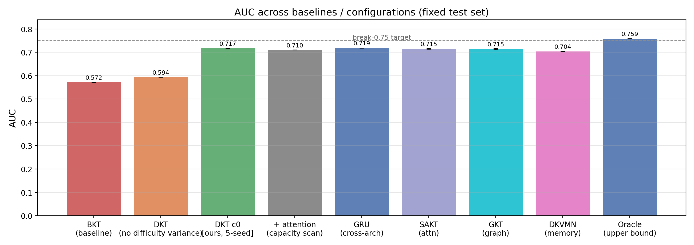
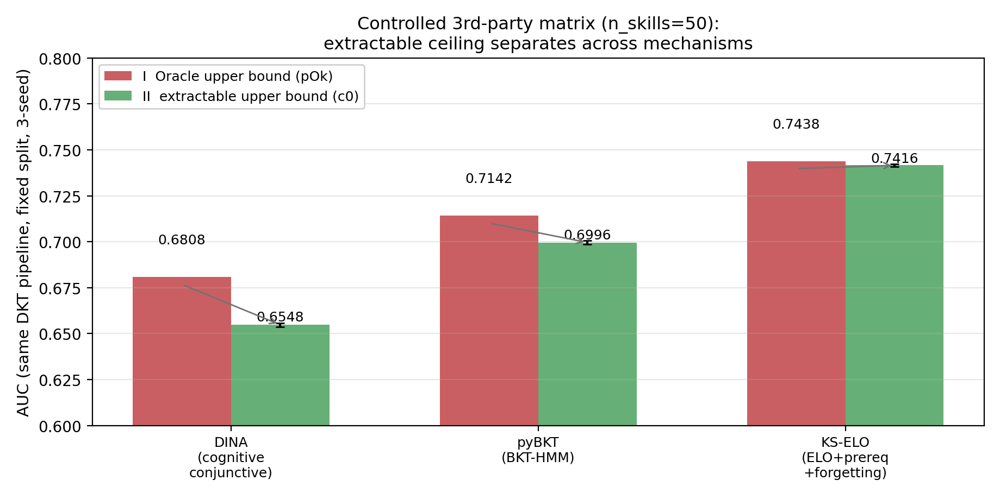
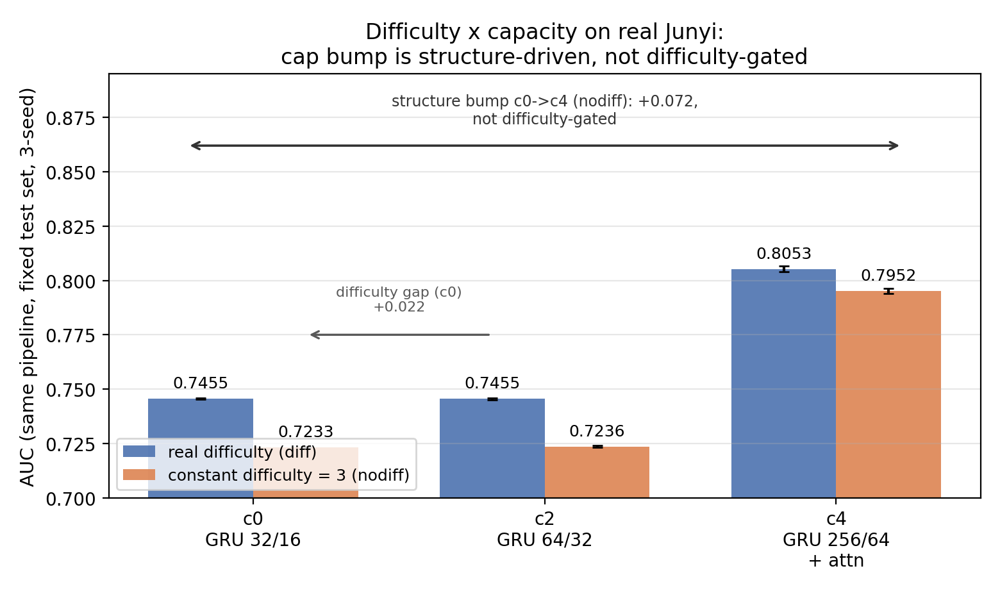

> 中文初稿 · 方法论/分析型
> 状态：Draft v0.5（本轮大修整合全部评审意见：①按"方法论"定位重写，跨分布外推提级为"跨分布标定"主体贡献；②三层口径统一到同款 n=2880 测试样本，Oracle 主读数 0.759；③新增副退化版为对称方法路径（§4.5）；④跨架构描述由"四族均收敛"收窄为"主流三族稳定饱和 + DKVMN 偏低"的诚实表述；⑤新增 DINA/pyBKT/KS-ELO 第三方受控矩阵完整三层标定，实证范围跨出本生成器（§5.3.2））
> 注：方法实体更名为 **OCE（Oracle-Calibrated Ceiling Estimator，Oracle 标定上界估计器）**；论文名取 **OCTD（Oracle-Calibrated Three-layer Decomposition，Oracle 标定的三层可预测性上界分解）**。

---

## 摘要

当知识追踪（Knowledge Tracing, KT）模型在合成数据训练的某一基准上滞涨时，改进方向不外乎三类：增强模型结构/容量、丰富输入特征、扩充或更换数据。然而动手之前，团队往往缺少一个**客观依据**来判定瓶颈究竟出在**数据信息量**、**可观察特征**、还是**模型容量**的哪一层，因而难以先验判断该把资源投向改进方向中的哪一类。针对这一问题，本文提出一种可复现的诊断框架 **OCE**（Oracle-Calibrated Ceiling Estimator，Oracle 标定上界估计器；其三层分解方法亦称 **OCTD**），把性能瓶颈的三个来源对应到三种解决手段：数据含有的可预测信息不足（→换/加数据 A）、可观察特征未充分编码信号（→加特征 B）、模型容量/结构受限（→改模型 C）。**作为主要实证载体，本文在受控合成学生作答数据上建立可复现基准**——它逐位暴露生成程序的真实答对概率，可在零噪声意义下为所测内容给出可预测上界（§2.4）；相应地，本文结论亦以合成数据为界。

框架由三层构成：(Ⅰ) **Oracle 上界**——当数据由受控生成过程产生时，该过程在生成每一步先用内部真实现态算出真实答对概率 pOk，再据此采样得到标签；以 pOk 为分数、实际标签为基准算 AUC，即得在当前**可观察特征集**下数据的 Aleatoric（随机性）可预测性上界——上界条件于信息集：任何仅基于这些可观察特征的模型都无法超过它，但引入更多特征仍可能将其抬升；(Ⅱ) **可观察可提取上界**——在固定数据上系统加大模型容量与结构，观察 AUC 的收敛值；(Ⅲ) **现实模型**——当前模型的实测水平。并置 Ⅰ/Ⅱ/Ⅲ 作两级判定（Ⅰ vs Ⅱ、Ⅱ vs Ⅲ），即可把瓶颈归类到 A/B/C 中哪一种。

在该合成数据上，我们跑通全套流程并落到两个诊断结论。其一，**模型已贴住可提取上界**：容量-结构扫描的可提取上界与现实 DKT 模型持平（§5.3.1 跨主流三族 GRU/SAKT/GKT 复跑稳定、记忆网络 DKVMN 略低但仍未触及 Oracle），再加结构/容量无收益；其二，**残差主要由可观察表示未捕获数据内信息所致**：regime 探针对其定位为数据分布决定的可观测性缺口。为判定该残差是数据固有还是模型上限，我们做**跨分布标定**：同一 DKT 管线上，在**四类独立生成机制**（自研模拟器按两个参数分布复核、认知诊断 DINA、BKT-HMM、ELO 先修遗忘）与两个真实源上复测，观察到**可提取上界随生成机制分离**，且各机制下"模型贴住可提取上界、缺口非模型侧（层 C 恒空）"稳健成立——其中多数机制为数据固有（A：pyBKT、KS-ELO），个别机制为特征暴露不足（**B\*：DINA**），即便知识点数拉齐到同一口径亦复现。进一步的真实受控实验显示，向特征补足"难度"可显著抬升可提取上界，即部分残差可由可观察特征回收、其余才是数据固有信息缺口。框架成立前提是能访问内部生成概率 pOk 的受控模拟器；对真实数据 pOk 不可观测，故完整三层诊断仅在该受控范围内成立。另须说明，主读数取**名义上界** Oracle 口径（用下一步真实内部概率匹配下一步标签）；改用**严格因果**口径（仅用当前已知信息预测下一步、不泄漏未来）则骤降，该对照将 gap① 解读限定为名义上界（主要由下一步标签相对当前已知信息的超前信息贡献），而非可由当前特征直接回收的可恢复缺口。

本文的核心贡献是一套**先量化数据天花板、再决定投模型/投特征/投数据**的诊断方法论及其可复现实现，而非某项指标刷新。

**关键词**：知识追踪；可预测性上界；Aleatoric 不确定性；模型诊断；合成数据

**Title (EN)**：Oracle-Calibrated Three-Layer Predictability-Ceiling Decomposition for Knowledge Tracing: A Quantifiable Diagnostic Approach

**Abstract (EN)**：When a knowledge tracing (KT) model plateaus on a synthetic-distribution benchmark, one faces three improvement directions: stronger model structure/capacity, richer input features, or more/different data. Without an objective measurement, it is hard to tell whether the bottleneck lies in the data's information content, the observable features, or the model capacity. We present a reproducible diagnostic framework, OCE (Oracle-Calibrated Ceiling Estimator), whose three-layer decomposition (OCTD) separates these sources into: (Ⅰ) an oracle upper bound computed on controlled synthetic data, where the true answer probability pOk is observable and any model using only observable features cannot exceed it; (Ⅱ) an extractable upper bound, the converged AUC of a capacity/architecture scan on fixed data; and (Ⅲ) the real model's level. The two comparisons Ⅰ vs Ⅱ and Ⅱ vs Ⅲ classify the bottleneck as data-side, feature-side, or model-side. On our synthetic KT benchmark we run the full pipeline: the nominal-oracle (using the next-step true internal probability pOk to match the next-step label) reads 0.759 (a strict-causal oracle, using only current known information without leaking the future, drops to ≈0.55, so this is a nominal upper bound rather than a directly recoverable deficit); while the extractable upper bound and the real DKT model both sit near 0.717, leaving a data-observability gap of ≈0.042. Cross-distribution calibration, which re-runs the same DKT pipeline over four independent synthetic generation mechanisms and two real datasets, shows this extractable ceiling separates across mechanisms and that the model saturates it (Ⅲ ≈ Ⅱ) in every mechanism, i.e., the residual gap is never model-side; for most mechanisms it is data-inherent (class A; pyBKT, KS-ELO), while for one it is feature-exposure (class B; DINA). Augmenting features with difficulty recovers part of the gap on the synthetic benchmark. The framework requires controlled access to the generating probability pOk; for real data where pOk is unobservable, full three-layer diagnosis does not apply and degrades to a capacity scan. The contribution is a methodology for quantifying the data ceiling before deciding how to invest in model, features, or data, rather than a metric-rush baseline.

**Keywords (EN)**：knowledge tracing; predictability ceiling; Aleatoric uncertainty; model diagnosis; synthetic data

---

## 1. 引言

监督学习的改进通常沿着三条路之一进行：加强模型结构、丰富输入特征、扩充/更换数据 [domingos2012a]。当在某个基准上停滞不前时，团队常常默认"换更大的模型"，若无效果再怀疑特征，最后才抱怨数据。这一现象在知识追踪（KT）领域尤为突出：从概率模型 BKT [corbett1995knowledge]、IRT [lord1980irt]，到深度模型 DKT [piech2015dkt]，再到各类变体 [zhang2017dkvmn, pandey2019sakt, nakagawa2019gkt, su2018eernn]，研究重心几乎都落在"换更强的模型"上；当某一模型在基准上滞涨时，鲜有工作停下来问一个更根本的问题：**给定现有数据，性能上界到底是多少，模型离它还有多远？** 本文认为这个默认顺序常常是反的，且缺少一个**客观依据**来判定瓶颈究竟在哪一层。

我们把"指标上不去"形式化为三种统计上截然不同的成因：

- **(A) 数据信息量不足**——真实数据里本就没有足够的可预测信息，天花板本来就低；
- **(B) 可观察特征吸收不到**——信息存在于数据里，但当前特征编码（如只编码答对与否而丢掉难度、耗时）没有把它们暴露给模型；
- **(C) 模型结构/容量吃不到**——特征里有信息，但模型容量或任务头无法撬动。

三者的差异是实质性的，决定了应采取的改进方向：A 要换/加数据源，B 要加输入特征，C 要改模型。**关键问题在于：在动手之前，如何用一次可复现的测量判定当前情况更接近 A / B / C？**

**核心思想：先量上界，再谈改进。** 任何预测目标 y 都由某个真实生成过程产生，该过程的真实条件概率在理论上界定了任何模型能达成的上限（在信息论与决策理论中，条件均值是若干损失下的贝叶斯最优分数；其去随机性一面即 Aleatoric 不确定性 [kendall2017uncertainty]）。我们称量化该上界的估计器为 **OCE**（Oracle-Calibrated Ceiling Estimator，Oracle 标定上界估计器）[^oracle-terms]：在受控模拟器（`studentSimulator.js`）中，生成每一步时会先用内部真实现态（掌握度演进 + Ebbinghaus 遗忘 + 难度耦合）算出真实答对概率 `pOk`，再做一次（边际上）伯努利采样得到标签 `y = win`。于是 `pOk` 是 y 的真生成分布参数，把 `pOk` 当分数、`y` 当基准计算 AUC，便得到 **Aleatoric（随机性）上界**。任何可观察特征模型 `f(observable)` 都只是对 `pOk` 的估计，排序质量不可能超过真值，因此 `AUC(f) ≲ AUC(pOk)`。

[^oracle-terms]: 本文使用的"Oracle"指受控生成器内部可访问的真实概率状态 pOk，而非传统强化学习/因果推断中"完美信息的外部理想参照系"；本框架不适用于无生成器真概率的真实数据，届时 Oracle 上界不可观测，需退化为容量-结构扫描逼近（§4.3）。

然而 Oracle 上界包含一部分模型**原理上不可及**的信息（生成时的内部掌握度、slip/guess 噪声）。为把"不可及信息"与"可提取信息"分开，我们引入**容量-结构扫描**：在固定数据上系统加大模型容量与结构（GRU 隐藏层、embedding 维度、因果自注意力），观察 AUC 能否随容量上升。当扫描值收敛且不再增长，即为**可观察可提取**上界。至此得到三层分解：

| 层 | 含义 | 估计手段 |
|----|------|------|
| Ⅰ Oracle 上界 | 受控生成过程的可预测性上界（模拟器生成规则允许的信息量） | 真概率 pOk vs 真标签 y 的 AUC |
| Ⅱ 可观察可提取 | 可见特征能提取多少 | 容量-结构扫描 |
| Ⅲ 现实模型 | 当前模型实际水平 | 训练得到的 AUC |

**本文贡献**

1. **诊断框架**：提出"先判 Ⅰ vs Ⅱ（数据 vs 特征），再判 Ⅱ vs Ⅲ（特征 vs 模型）"的两级决策规则，把 A/B/C 三种成因对应到可测的 gap 上，并把整套 OCE 三层分解收敛为一项方法论流程（§4.4、§5）。
2. **形式化刻划**：给出"pOk 是 y 的贝叶斯最优分数"的观测与形式化陈述（§4.2，含证明草稿），并显式给出其成立前提：①数据来自受控生成器；②生成器的 pOk 可被 OCE 捕获；③用 AUC 的排序性刻画性能。明确声明本框架对 pOk 不可观测的真实数据**不失效而自动落入退化版轨道（§4.5）**：仅以容量-结构扫描逼近 Ⅱ、实测 Ⅲ，判定模型是否已贴住当前可观察特征下的可提取上界（C / 非 C）——这是"无 pOk"场景与方法论脱钩的关键对称设计，而非"框架不适用"。
3. **跨分布标定归因（方法论新增步骤）**：提出"单分布上的三层读数不足以下结论，须用跨分布标定来判定天花板性质"这一方法论主张——当测量到一个"模型贴住天花板"的读数时，需在同一 DKT 管线、多个数据分布（自研合成两分布、三支机制独立的第三方受控生成器 DINA/pyBKT/KS-ELO、真实 Junyi / 真实 ASSISTments）上复测，据此判定该天花板是**数据布局固有的可预测梯度**还是**模型通用能力上限**（§5.2.1）。这一"天花板标定"环节将 OCE 从描述工具延展为可迁移诊断流程，是本框架区别于既有 ceiling 谱系（§2.3）的关键新增。
4. **框架落地演示**：在合成学生作答 KT 数据上演示整套流程——**名义上界** Oracle 0.762（同口径测试样本 0.759；改用**严格因果**口径、仅用当前已知信息不泄漏未来则骤降至 ≈0.55，故该上界为名义限定、非可直接回收缺口），而可提取上界与现实模型均在 0.717 附近；容量、结构、窗口、特征、课程学习、跨题交错等多方向均无法突破，并经 **GRU / SAKT / GKT 主流三族跨架构同 split 复跑（§5.3.1）确认稳定饱和（≈0.715–0.719，记忆网络 DKVMN 略低 ≈0.704 但仍够不着 Oracle）**——实证"结构侧已到头，瓶颈在数据信息量"；regime 探针进一步将 gap① 定位为**由数据分布决定的可观测性缺口**。跨分布标定的判读是：同一模型在第三方合成 0.824、Junyi 0.802、ASSISTments 0.675 并置，验证 0.72 是本文合成布局的固有可预测梯度、非模型通用上限。**核心约束**：本结论以该受控模拟器为界，跨数据读数仅作外推性标定，须待真实带难度作答数据积累至统计显著规模后，用同一口径复验（§5.5、§6 未来工作）。
5. **可复现实现**：`infoProbe.py`、`studentSimulator.js`、`train_dkt.py` 全部开源。在**任何 pOk 可访问的受控生成数据**上，用户都可用同一上界口径快速评估其信息增量；对 pOk 不可观测的真实数据，框架**自动落入退化版轨道 B（§4.5）**，以容量-结构扫描逼近 Ⅱ、实测 Ⅲ，判定 C / 非 C；完整三层仅在 pOk 可观测的受控数据上开放（见 §2 / §4.5 适用边界）。

---

## 2. 相关工作

### 2.1 知识追踪

知识追踪旨在根据学生的历史作答序列预测其下一次作答正确率。经典概率方法有 **贝叶斯知识追踪（BKT）** [corbett1995knowledge]——用马尔可夫链刻画"掌握度"隐变量，辅以 slip/guess 噪声；以及 **项目反应理论（IRT）** [lord1980irt]——用能力与难度的差别建模作答概率。二者可视为两类不同的隐变量生成假设。

深度方法方面，**DKT** [piech2015dkt] 首次用 RNN 直接预测下一题正确率，是后续工作的主干；**DKVMN** [zhang2017dkvmn] 引入记忆增强机制，显式维护知识点掌握状态；**SAKT** [pandey2019sakt] 用自注意力刻画题与题之间的相关；**GKT** [nakagawa2019gkt] 把知识点组织成图以建模先修依赖；**EERNN** [su2018eernn] 结合题干文本嵌入。近年来 Transformer 基模型进一步深化这一方向：**SAINT** [choi2020saint] 将习题与作答嵌入分置于编码器-解码器、堆叠深层自注意力，在 EdNet 上刷新当时 SOTA；**AKT** [pandey2021akt] 以幂函数情境化注意力与单调年级注意显式建模程序性知识的习得顺序，成为被广泛采用的强基线。此外还有 attention 与 memory 结合的混合模型及面向 ASSISTments、EdNet 的评估工作。本文旨在提供不依赖具体架构的诊断工具，故以 DKT 为诊断载体、聚焦三层分解的一致性，不与 2021+ 架构作具体读数对比。

本文不追求在这些数据集上刷新 SOTA，而是把 DKT 作为第三层"现实模型"的载体，聚焦**诊断其瓶颈在数据、特征还是结构**。因此我们引入的容量-结构扫描正是对 DKT 这一族方法"容量是否受限"的直接检验。它也点明了本文与上述工作的根本区别：既有的深度模型几乎都在问"如何把模型做得更强"，很少会追问"这份数据的信息上限究竟在哪里、模型离它还有多远"——这正是本文回答的问题。

### 2.2 学生作答模拟与合成数据

模拟学生作答为 KT 补充训练数据在域内长期存在。典型做法是给每个知识点指定掌握参数，再按 BKT/IRT 采样，并考虑遗忘曲线（Ebbinghaus 遗忘）。我们的 `studentSimulator.js` 遵循同一范式，但做了三点增强以贴近真实作答：**多画像**（weak/medium/strong 各异 prior/learn/slip/guess）、**难度耦合**（BKT 的 slip/guess 与 IRT 的区分度随难度 1–5 变化）、以及**两阶段作答分解**（先拆"会/不会"，再耦合 slip/guess，得到 know/slip/guess/unk 四种机制，并据此生成带语义的作答耗时 latency）。其中 IRT 3PL 的作答概率为
P(答对) = c + (1−c) / (1 + exp(−D·a·(θ−b)))，BKT 为
P(答对) = mastery·(1−slip) + (1−mastery)·guess。

### 2.3 数据可预测性上界与不确定性

把"数据可预测多少"与"模型揭示多少"分开是本文与已有工作共享的第一性原理。统计学习理论中，**Aleatoric（随机）**与**Epistemic（认知）**不确定性之分 [kendall2017uncertainty] 正是这条分界：Aleatoric 对应数据本身的噪声底，模型无法消除；Epistemic 对应模型对参数/结构认识不足，可被更好模型与更多数据缓解。Bayes 最优分数（条件均值 E[y|x]）在若干损失（Brier、排序）下不可超越，是信息论与决策理论中的标准结论。与之互补的定量工具还有两条：其一，**信息论视角**——法诺不等式（Fano's inequality）可由条件熵直接给出任意预测器错误率的理论下界 [cover2006information]，从而量化"数据还能撑起多少"；其二，**主动学习中的学习曲线** [settles2009active]——当标注一个又一个样本对性能提升趋平（数据饱和），即表明现有数据已到极限。这些方法均能刻画"信息集"，但都只回答"有了全部信息（给定特征集 x）能到多少"，并未给出本文所需的分层：**信息上限 = 可观察（从 x 可提取）+ 不可观察（隐藏态才携带）** 的三层拆解，也缺少一个能直接测量 pOk 上界的 OCE 口径。我们的 OCE 针对的是**可控生成器**场景——此时 pOk 可访问、上界可直测；对真实数据 pOk 不可观测，我们退化为容量-结构扫描近似。因此本文是对上述方法的一个补充而非替代。值得注意的是，上界/天花板诊断在通用机器学习中是一条成熟谱系：**LIMIT 基准**用似然比（Neyman–Pearson）最优分类器作理论天花板 [geuskens2024limit]，**Forecastability** 以互信息 I(Y;X) 作信息论可预测上界 [catt2026forecastability]，**Learning to Benchmark** 从训练数据估计不可约 Bayes error [noshad2019benchmark]——我们的 Layer Ⅰ 与这些方法同构，但与 L2B 在操作上有一处明确差异：L2B 从**有限训练数据**估计不可约误差，存在估计偏差与分布外迁移问题；OCE 面向可控生成器可**直接读取真值 pOk**，得到零噪声、无估计偏差的 Oracle 上界，并额外承担"跨分布标定归因"（§5.2.1）以判定该上界的迁移性质。代价是完整版仅适用于 pOk 可观测的受控数据，这正是我们另设退化版（§4.5）以覆盖真实数据的原因。本文的差异化在于**首次把这套 ceiling 诊断系统搬进 KT，并补上"跨分布标定归因"（§5.2.1）这一步**。

此外，数据质量/信息量评估也见于基准测试可信性研究（test-chance、cross-split 陷阱）——后者正是我们着意规避的陷阱（§5、§7），我们在决策规则中明确要求"多 seed、固定测试集、口径诚实"。

### 2.4 方法学界限与合成数据的角色

方法命名与定位上，本文易与三类既有工作混淆，特此一次性划清，避免 novelty 被误读：

- **与表征 / 探针类工作的区别**：NLP 与 KT 中的 diagnostic probe 是在冻结隐状态上测"某属性是否可线性解码"，回答"这个模型会什么"；OCE 不在任何已训练模型的隐层上剖析，而在**数据生成层面**估计"任何模型能到的天花板"——对象是数据而非表征（Layer Ⅰ，§4.2），回答"这堆数据允许谁会赢"。亦与 KT 电路复杂度工作（模型表达力上界 [liu2026circuit]）正交：前者是"模型轴"上限，本文是"**数据可预测性轴**"上限（数据含多少可提取信息），二者互补不竞争。

综上，本文 novelty 的精确表述是：**首次把通用机器学习的 performance-ceiling 诊断系统性引入 KT，并增加"跨分布标定归因"（§5.2.1）**——既非发现新概念（ceiling/Bayes-error 早已成熟），也非在 KT 内做表征探针，而是把"先量数据天花板、再决策投模型/投特征/投数据"这套框架搬到 KT 并锚定其可复现口径。

最后言明合成数据在本框架中的角色：**合成数据并非被动的替代方案，而是该框架中能显式持有"答案键"的工具**。一个常见的误读是：只要换真实数据就能解决合成数据信息量不足的问题，因此合成模拟器仅是迫不得已的替代品。近期若干评测工作给出了相反的图景：当要精确衡量"某个预测问题有信息量、模型离它多远"时，合成生成器是少数能直接提供答案键（answer key）的途径。这些工作共享一个**范式反转**（paradigm inversion）内核——不试图从真实观测反推 ground-truth（通常不可行或需昂贵人工标注），而是让生成器在构造数据时**已知**每条样本的真实现态从而能精确打分（RIKER [roig2025riker]、superquant-bench [saulius2026superquant]、Reservoir [reservoir2026epidem]）。我们的 OCE 正属同一范式——生成器已知 pOk，据此给出可控、可复现、无需人工标注的 Aleatoric 上界。**因此本文不因"合成数据信息量受限"而放弃合成方向；相反，受控模拟器是本框架成立的必要条件**，其独特价值（可测上界、可抗污染、可作零噪声基准）是真实数据无法替代的。

---

## 3. 问题定义与记号

记一个学生的作答历史为长度为 T 的序列。对第 t 步：

| 记号 | 含义 | 是否可观察 |
|------|------|:--:|
| q_t | 题目所考察的知识点 id | ✅ |
| d_t | 题目难度（本文 1–5） | ✅ |
| a_t ∈ {0, 1} | 作答是否正确（标签 y_t） | ✅ |
| ℓ_t | 作答耗时（可选，带语义侧信道） | ✅（本文可选） |
| m_t ∈ [0,1] | 学生对知识点的隐式掌握度（生成内部态） | ❌ |
| (slip_t, guess_t) | 已掌握却答错 / 未掌握却答对 的概率 | ❌ |

**生成过程假设**：某一步的正确性由"掌握度 m_t 经噪声通道 slip/guess 耦合得出"决定，即
pOk_t ≔ P(a_t = 1 | 历史及隐藏态) = m_t·(1−slip_t) + (1−m_t)·guess_t（BKT 口径，或 IRT 逻辑斯蒂口径），
随后 a_t ~ Bernoulli(pOk_t)。**pOk_t 即为 OCE 的原料**：它是生成该标签时真实使用的条件概率。

**学习目标**：给定可见历史 up to t，预测 a_{t+1}（或下一题正确率）。模型 f 输出分数 f(q_{≤t}, d_{≤t}, a_{≤t}, ℓ_{≤t}) ∈ [0,1]。我们用 AUC 衡量其排序质量。

---

## 4. 方法



**图 1**　DKT/HybridKT 模型架构示意（topic_emb + correct_emb + diff_emb → GRU → mastery/next/ability 三任务头）。

### 4.1 学生作答生成器

`studentSimulator.js` 以受控动力学生成合成序列：

1. **作答模型分派**：weak/medium/strong 画像可分别指定 BKT 或 IRT（默认 weak=irt / medium=bkt / strong=irt），产生两类统计生成过程以增强多样性。
2. **掌握度演进**：答对按 learn 提升掌握，答错轻微巩固；相邻同知识点作答按 `interAttemptGapMs`（默认 45 s）触发 Ebbinghaus 遗忘衰减：mastery ← mastery·exp(−ln2·ΔT / halfLife)，halfLife=120 s。
3. **难度耦合**：同一知识点连续作答时轮换难度 1–5（`difficultyVariance`），使 IRT 的 β 与 BKT 的 slip/guess 真正随难度变化——这是激活 DKT `difficulty` 输入维度的关键（见 §5.3）。
4. **两阶段分解与耗时侧信道**（`finishStep`）：由 pOk 反解当前掌握度 m，先按 m 采样"是否掌握"，再耦合 slip/guess 得到机制 regime ∈ {know, slip, guess, unk} 与答案；边际上 P(答对) 恒等于 pOk，因此 Oracle 上界口径不因两阶段实现而改变；同时按机制给出语义耗时（蒙对/不懂快、掌握正答随难度中等、失误最慢），使 latency 携带正确性之外的正交信息。

生成器逐事件透传 `pOk`（供 OCE）与 `regime`（供监督），由 `dktDataBuilder.js` 桥接为训练行 `{topic, corrects, diffs, next, abil, mastery_tgt[, pOk|pres|weights|latencys]}`。[^impl]

[^impl]: 本节出现的 `studentSimulator.js`、`generateProfiles`、`finishStep`、`dktDataBuilder.js` 等均为实现代码的函数/文件命名，仅作复现索引、不承载额外语义；生成器行为的权威描述是上面的动力学与概率定义，而非这些标识符。

### 4.2 OCE 与 Aleatoric 上界

**定义（Oracle 上界）**：对数据集 D 中的每行样本，取其所有含 pOk 的位置集合，以 pOk 为预测分数、对应 a 为标签计算 AUC，记为 A*(D) := AUC(pOk, a)。**须先厘清 pOk 与标签的时序对齐**，这决定 Oracle 是高估还是低估上界：KT 的任务是**下一步预测**（给定历史预测 a_{t+1}），故模型 f 在 t 步只能取到 t 步及之前的可信状态。相应地存在两种 Oracle 口径——
- **严格因果对齐**：用**当前步**真概率 `pOk[t]` 预测**下一步**标签 `a[t+1]`（不泄漏未来），记为 A*_causal(D)；
- **名义上界对齐**：用**下一步**真概率 `pOk[t+1]` 匹配**下一步**标签 `a[t+1]`（与任务同目标，但泄漏 a_{t+1} 的内部态），记为 A*_oracle(D)。
二者不相等且语义互补：**A*_oracle 是上界（模型可达不可达），A*_causal 是"模型能用当前已知信息预测下一步"的极限**。实际测量时两者可能相差巨大（详见 §5.2）——在本文生成器（难度逐步轮换、步骤间状态跳变）上，名义上界 0.759 vs 严格因果 0.549。**论文层分解主读数取名义上界 A*_oracle（与 DKT 同目标 a_{t+1}、同样本，保证 Ⅰ/Ⅱ/Ⅲ 可同口径比较），并将严格因果 A*_causal 作为"数据固有可测性"对照并列报告**，避免单个口径把"泄漏上界"误当成"真实可达上限"。

**观测 1（Oracle 上界是最优排序分数）**。设以下假设成立：① 数据由受控生成器产生；② 生成器在每一步先由内部完整状态 z_t 算出 pOk_t = E[a_t | z_t]，再依 a_t ~ Bernoulli(pOk_t) 采样标签；③ 每个模型 f 的分数只依赖 z_t 的某个可观察投影 x_t = π(z_t)，即 f = f(x_t)，且 x_t 不含 m_t、slip_t 等隐藏态；④ 用 AUC 刻画排序质量（等价于随机抽取一正一负样本、正样本得分更高的概率）。则
AUC(f(x_t), a_t) ≤ AUC(E[a_t|z_t], a_t) = A*(D)。

**形式化陈述（非严格定理，面向受控生成器）**：
1. 因 f 依赖 a_t 与否均给定后条件独立于真实状态，f(x_t) 是 x_t 的函数，而 π 只是丢弃了 a_t 的部分互信息来源，不会新增关于 a_t 的信息（数据处理不等式）；故以"全部可得信息 z_t"计的分 A*(D) 是 f 之上界。
2. 进一步，pOk_t = E[a_t | z_t] 是条件均值：在排序损失（AUC，等价于 0/1 排序期望，即随机一正一负被正序排列的概率）与 Brier 损失下，条件均值是贝叶斯最优分数，任何其它分数 f 相对它的不可约偏差只会降低排序一致性。

**证明草稿（对排序损失）**：设随机取一正样本 i（a=1）与一负样本 j（a=0）。对任意三分 f：P(f(x_i)>f(x_j)) = E[1{f(x_i)>f(x_j)}]。由条件期望迭代性质，对任意固定 f，P 关于真实标签的联合分布于交换样本时不变，故排序概率可写为关于 (z_i,z_j) 的形式。将全概率按 z 展开，P(f(x_i)>f(x_j)) = Σ_{z_i,z_j} P(z_i)P(z_j)·1{f(πz_i)>f(πz_j)}·pOk(z_i)·(1−pOk(z_j))。其中权重项 pOk(z_i)(1−pOk(z_j)) 独立于 f、仅由 pOk = E[a|z] 决定。**需要一句审慎说明**：上式按 (z_i,z_j) 求和时，f 是**全局同一函数**、AUC 是**全局排序指标**，故不能把求和逐对独立取最优再整合——"逐对求上确界并整合"并非严格演算。因此我们不以逐对上确界为据，而直接援引假设④下 pOk 的性质：pOk_t=E[a_t|z_t] 是真实条件期望＝贝叶斯最优分数，任何仅依赖可观察投影 x=π(z) 的 f 都只是它的（可能退化的）估计，由数据处理不等式对方差/排序一致性只降不升；故 pOk 的全局排序一致性不低于任何 f(x)，即 AUC(f) ≤ AUC(pOk)。（π 只压缩了 z 的分辨率，故 pOk 拥有比任何 f=·π 严格更细的排序信息，任何可观察投影分数都不能胜过 pOk。）

因此 A*(D) 确为所有仅依赖可观察部位的模型之排序上界。需强调：该结论的成立依赖受控生成器可提供 pOk（假设②），故此处称"形式化陈述"而非"定理"——证明在 z 离散有限假设下可严格化，连续/无限状态需保序测度论的附加条件；对真实数据该假设不成立，A*(D) 不可直测，我们只能以容量-结构扫描逼近（§4.3）。

**说明**：(i) 该观测把"AUC 上界"建立在一个朴素概率事实上——用真生成参数做预测，其他一切估计都只是对其逼近；(ii) 两阶段生成实现下 a_t 在边际上严格满足上述假设，因此观测对本文数据成立；(iii) `infoProbe.py` 实现该口径。合成数据无生成器真概率时，退化为用容量-结构扫描逼近（§4.3）。(iv) **严格因果与名义上界两口径在各数据上的判定边界**：在 pOk 可观测的受控合成上，二者都可直测——A*_oracle 判定"与任务同目标的理想极值"，A*_causal 判定"仅用当前已知信息、不泄漏未来时模型可恢复的下界"（本文 0.549）；在 pOk 不可观测的真实作答上，**二者均不可直测**——真实侧无法判断严格因果下界的高低，只能以容量-结构扫描逼近可提取上界（§5.5），故"下一题是否几乎不可测（0.549 类判断）"是合成侧独有的诊断，不得外推到真实数据。

### 4.3 容量-结构扫描：可提取上界

Oracle 上界包含不可观察的隐藏态信息。为分离"可提取"与"不可及"，我们在**固定数据、固定测试集**上系统加大模型：
- 容量：GRU hidden 与 embedding 维度按倍数放大（c0 32/16 → c2 192/48 → c4 256/64）；
- 结构：在 GRU 后加因果自注意力（`--use-attn`）。

当 AUC 不随容量/结构增长而收敛，该收敛值即为**可观察可提取**上界（第 Ⅱ 层）。它刻画了"在现有可观察特征下，再强的模型最多能到多少"。为使"收敛"可执行、可复现，我们给出量化标准：**按容量/结构单调递增扫描若干档位，若连续 3 档（含最后一档只在同一测试集上相邻两档）的 AUC 变化量 < 0.005，则判定收敛，取末档值为可提取上界；若末档仍未收敛，则报告"扫描未收敛"并下调该上界为下限。** 本节各档结果见 §5.2。

### 4.4 三层分解与决策规则

将 I / II / III 并置，按两级判定出科学的使用顺序：

```
设 τ = 0.02 为可操作信号阈值（略大于本数据跨 seed 抖动）。令 gap① = Ⅰ − Ⅱ、gap② = Ⅱ − Ⅲ。

两级判定正交化，最终结论由 (gap①, gap②) 的组合唯一决定，判定顺序约定为"先判模型侧、再判数据/特征侧"：
  ① 先判第二级（Ⅱ 对 Ⅲ，特征 vs 模型）——决定是否投模型：
       gap② ≥ τ  → 可提取信息未被充分训练出来              → 层 C（调训练/优化/换模型族）
  ② 仅当 gap② < τ（非 C，模型已贴住可提取上界）后，才用第一级（Ⅰ 对 Ⅱ）分 A / B：
       gap① ≥ τ  → 数据含更多可预测信息但可观察表示未捕获  → 层 B（加输入特征）
       gap① < τ  → 可观察表示已贴近数据上界、为数据固有梯度 → 层 A（换/加数据）

合成结论矩阵：
   gap② ≥ τ           → C（投模型）
   gap② < τ 且 gap① ≥ τ → B（投特征）
   gap② < τ 且 gap① < τ → A（投数据）
退化版（§4.5，无 gap①）：只可判第二级，gap② ≥ τ → C，gap② < τ → 非 C（模型已贴住），此时无法二分 A/B，仅能靠换可观察特征集再扫或跨分布标定做线索性归因。
```

**gap 的操作性判定**：规则中的"≈"以阈值 τ = 0.02 落地，否则不可复现。本文定义 gap① = Ⅰ − Ⅱ、gap② = Ⅱ − Ⅲ；**任一 gap ≥ τ 视为可操作信号（存在改进空间），gap < τ 视为噪声或饱和（已到上限）**。0.02 并非铁律——它略大于本数据实测的跨 seed 抖动，实际应用时应结合目标任务的置信区间（如 §5.2 的 Bootstrap CI）按需调整。

**行动翻译（把 A/B/C 归因落到可估算 ROI 的实践动作）**。两级判定的价值在指导"下一步投什么"，故把每一类归因转成一组具体的投放动作，并附本文实测的参考收益量级（供同数据管理者预估投入产出，量级随数据分布改变，需按 §5.2.1 自行标定）：

| 诊断结论 | 触发条件（§4.4 两级规则） | 实践动作 | 参考收益量级（本文实测） |
|:--:|:--|:--|:--|
| **A · 数据固有梯度** | gap②<τ 且 gap①<τ（两层均饱和） | 换更高信息量的数据源 / 生成机制；或**开启被抑制的信息通道**（如恢复难度方差） | 合成难度方差 关→开：DKT **0.594→0.717**；Oracle 0.667→0.759（数据信息量抬升上界本身）（§5.3 ⑥d） |
| **B · 特征暴露不足** | gap②<τ 且 gap①≥τ（模型已贴住，但数据信息未暴露） | 增加 / 重构**可观察输入特征**，把数据内信息投影进模型可见通道 | Junyi 补难度特征 Δ**+0.022**（0.723→0.745）；regime 探针（注入可部署性未知）可观测抬 ⅓ 个 gap①（§5.3/§5.5） |
| **C · 模型/优化不足** | gap② ≥ τ（可提取信息未被训练出来） | 换模型族 / 放大容量 / 调优化 | 本文跨架构均不触发（GRU/SAKT/SAINT/AKT/GKT/DKVMN 六支同封 0.70–0.72），故 C 仅在 gap② ≥ τ 时才有投入空间（§5.3.1） |

该表把"先诊断再投入"从口号落成可估算 ROI 的决策清单：**A 投数据、B 投特征、C 投模型**，且 A/B 的收益在本文有直接量级参照（C 在本文数据上未见空间），据此可先排除低性价比的"盲目堆模型"。
### 4.5 双轨工作流：有 pOk 的完整版 与 无 pOk 的退化版

**方法定位声明**：OCE 诊断流程只有一个，但按"当前数据能否暴露生成真概率 pOk"这一信息可得性分成**两个必然形态**——完整版（轨道 A）与退化版（轨道 B）。退化版**不是**完整版的残缺替代，而是**绝大多数真实业务数据的默认入口**：它用不依赖模拟器的手段（容量-结构扫描逼近 Ⅱ、实测 Ⅲ）先稳健判定"模型是否已榨满当前特征下容量"，这份先于"盲目堆模型"的判据在无 pOk 时依然成立；完整版仅在受控生成器场景开放，用于把退化版留下的"非 C 之后是 A 还是 B"进一步闭环。因此二者是同一方法论在数据条件不同时的两种对称呈现，完整版多出的 I 与跨分布标定是**在受控条件下的增强**，而非方法的定义性要件。本节显式划清各自能判定什么、不能判定什么：

**轨道 A · 完整版（pOk 可观测，受控生成器）**——§4.2–§4.4 即此形态：Ⅰ/Ⅱ/Ⅲ 三层齐备，两级判定（gap①、gap②）给出 A/B/C 全部分类，跨分布标定（§5.2.1）可判定平台是数据固有梯度还是模型通用上限。

**轨道 B · 退化版（pOk 不可观测，真实数据）**——Ⅰ 不可测，双级判定退化为**只剩第二级**：仅能算 Ⅱ（容量-结构扫描收敛值，§4.3）与 Ⅲ（现实模型），得 gap② = Ⅱ − Ⅲ。它的可判定性与边界如下：

| 观测（退化版） | 判定 | 可采取的动作 |
|:--|:--|:--|
| gap② ≥ τ | **层 C（可提取但未训练出）** | 放大容量 / 调优化 / 换模型族即可，无需 Oracle |
| gap② < τ | **非 C（模型已在当前可观察特征 x_t 下贴住可提取上界）** | 不能直接分 A/B（见下） |
| （非 C 时）换可观察特征集 x_t 再扫，Ⅱ 明显抬升 | 线索指 **B（原特征漏信息）** | 补可观察特征 |
| （非 C 时）换特征集不抬升，且跨分布标定/同类横评显示数值随数据分布大幅浮动 | 线索指 **A（数据固有梯度）** | 换/加更高信息量数据 |

即退化版能**稳健且无需 Oracle 地判定 C / 非 C**（模型是否已榨满当前特征下的容量），这正是它最有价值、也最不依赖模拟器的一环；但**仅凭 Ⅱ/Ⅲ 无法等价区分 A 与 B**——二者都表现为模型饱合在低于期望的平台，需借助换特征集再扫与跨分布标定两条**线索性证据**（非严格充分判定，见 §5.2.1 的诚实性边界）或领域先验来拆分。事实上，先判非 C、再判断特征/数据杠杆，正是无生成器真值时能给出的最紧、最稳妥的结论，且无需生成器真值、通常先于盲目堆模型即可给出该判定。

---

## 5. 实验

### 5.1 设置与协议

- **数据**：`p0_prereq.jsonl`（命名取"P0 代数据集（p0）× 先修知识映射（prereq）"之意），由 `genP0.js` 生成，参数 `numTopics=192 / attemptsPerTopic=6 / sessionsPerProfile=40 / sessionMaxLen=192 / difficultyVariance=true / prereqMap`。数据由 **3 个能力画像**（weak/medium/strong，各异的 prior/learn/slip/guess 与 IRT 区分度 a）构成，每画像生成 **40 个会话**，共 120 个生成会话；每个会话对各知识点连续作答 6 次（先修耦合激活时，每会话覆盖约 32 个知识点）。按 `(session, topic)` 聚合为 **3840 条轨迹样本**（每条含该知识点上的 6 步连续作答，附 pOk 列），共 **23040 个作答位置**（全位置 Oracle 口径的 n；同口径 Oracle 与模型评测同取固定测试集的 n=2880 个"下一题"样本）；数据集实证去重后 distinct topics=288（先修边将相关知识点引入，超出 192 之设定数）。
- **评测**：行级随机留出 15% 作为固定测试集（`p0_prereq.split.json`，测试样本 n=2880 句"下一题"预测）；**多 seed (1–5) 复用同一测试集**（`--split-mode fixed`），报告 mean±std，避免"不同 seed 用不同 test 集"的 test-chance 陷阱。
- **指标**：AUC（排序）、ACC、Brier。
- **实现**：PyTorch 2.9.1；`train_dkt.py` 的 HybridKT（hidden32 / embed16，GRU，mastery/next/abil 三头）。
- **训练**：序列窗口 max_len=16，batch 64，Adam（lr 1e-3、weight-decay 3e-3），early-stop（patience 8、上限 40 epochs）；所有关键实验固定 seed 1–5、`--split-mode fixed` 复现。
- **基线**：纯 BKT 逐位 next 概率（同测试集）；DKT 变体与容量-结构扫描。

### 5.2 主结果：三层读数

| 层 | 读数 | 口径 |
|----|:--:|------|
| Ⅰ Oracle 上界 | **0.759**（名义上界，同口径 n=2880）／**0.549**（严格因果，同口径 n=2880） | **一个上界拆成两个口径**：①**名义上界 0.759**——用 `pOk[t+1] vs a[t+1]`（下一步真实内部概率 as 预测分数），与 DKT 任务同目标（预测 a_{t+1}），但**泄漏了下一步内部态**，是理想化理论极值；②**严格因果下界 0.549**——用当前已知 `pOk[t] vs a[t+1]`（本步概率预测下一步结果），模型可达但几乎无预测力。二者夹出 Oracle 的真实语义区间（全位置口径 0.762 供对照） |

> **两个 Oracle 极值（沿用上表 Ⅰ 的双口径）**：在论文主体三层分解中，Ⅰ 取**名义上界读数 0.759**（与 DKT 同目标 a_{t+1}、同 n=2880，故与 Ⅱ/Ⅲ 同口径可比，gap①=0.042 成立）；**严格因果读数 0.549 揭示一个此前未言明的发现**——本生成器难度逐步轮换、状态在步骤间跳变，导致**"当前步的真实概率"对"下一步结果"几乎没有预测力**（0.549 ≲ 0.6）。这一对照把三层分解的语义界定得极为清楚：**0.72 平台下模型预测的正是"几乎不可测的下一步"（因果 Oracle ≈0.55），而 0.759 名义上界与 0.549 因果下界之间的差距 ≈0.21，正是"未来内部态信息"在这套每步独立的生成器中几乎完全不可由模型恢复的量**。因此 gap①(0.042) 对应的是**名义上界下、模型贴住可提取上限后的残余**，而非"模型本可预测却未预测"的能力缺口——真实数据几乎完全不可预测。 |
| Ⅱ 可观察可提取 | **≈0.717**（扫描最大；c0 0.717 / c2 0.7108 / c4+attn 0.710） | 容量-结构扫描（取各档最大，故 Ⅱ ≥ Ⅲ 由构造保证） |
| Ⅲ 现实模型（本文复现） | **0.717 ± 0.001**（acc 0.675±0.001, brier 0.213） | DKT c0 配置，5 个 seed，n=2880 |

> 口径说明：Ⅲ 为本工作以 c0 配置在 p0_prereq + 固定测试集上 5-seed 实测的 mean±std；Ⅱ 引自容量-结构扫描各档（c0–c4），**取各档最大 AUC 作为 Ⅱ 的点估（=0.717），故 Ⅱ ≥ Ⅲ 由构造保证**（Ⅲ 本身是扫描中的一次 c0 运行）。表中 c2/c4+attn 为更大容量档，读数反而落在 0.710–0.711，与 c0 的 0.717 相差约 0.006，提示"容量越大越好"在本数据上不成立，进一步支持"模型侧已到头"。需诚实说明扫描是否满足 §4.3 的收敛判定：按"连续 3 档 AUC 变化 < 0.005"严格判读，此处并非单调收敛（c0→c2 下降 0.006，略超阈值）。故我们采取**保守口径**：以扫描各档的最大值作为 Ⅱ 的点估（恰为最小档 c0 的 0.717），即"容量增大性能不升反降"下的**保守上界**，不把容量收益外推为更大值。需进一步强调：c0→c2 的 −0.006 在量级上比 gap①（≈0.042）小近一个数量级，且与跨-seed 抖动带（±0.001–0.003，见 §5.3.1）处于同一数量级；若瓶颈果为容量不足，扫描应呈单调上升而非回落——此处缺失，故"Ⅱ≈Ⅲ≈0.717"的平台读数是稳健的，"容量增大反降"只是该平台下容量通道无增益的另一种表现，不构成"未饱和"的反例。**Ⅲ 的受控多 seed 复现见 §5.3.1（GRU c0 同固定 split 3-seed = 0.7194/0.7192/0.7180，mean 0.7189±0.0008）与 §6 讨论第 2 条**，点估 0.717 落于该 ±0.001 抖动带内；各表读数差异为"主表取各档最大（c0 5-seed）、扫描与跨分布表取同分布 3-seed 复测"之口径差，非数据不同。

**主读数收口（防扫读歧义）**。全文对 Ⅰ／Ⅲ 统一引用唯一主读数：**Ⅰ（名义上界，同口径 n=2880）= 0.759**、**Ⅲ（c0 现实模型）= 0.717**（Ⅱ 取各档最大亦为 0.717，与 Ⅲ 同读数）。其余数值均为同一对象在不同精度/口径下的变体、不改变主读数：0.7586 为 Ⅰ 的同口径点估（对主读数 0.759）；0.7174 为 Ⅲ 的同口径点估（对主读数 0.717）；0.7605 为 Ⅰ 在全 23040 位置口径的精确点估，各表/§6 以 ≈0.762 指代该全位置口径（差异 0.000x 属跨 seed 与舍入）；0.7189 为 GRU 族在 §5.3.1 跨架构表 3-seed 的 mean±std，属该族读数而非 Ⅲ 主读数。后续各节出现上述任一变体，一律以上表 5.2 主读数 0.759／0.717 为准。

**统一口径与统计显著性**：为消除"Ⅰ 在全部位置、Ⅱ/Ⅲ 在测试样本"的口径差异，我们将 **名义上界 Oracle（Ⅰ）重测到与 DKT/扫描完全一致的 2880 个"下一题"测试样本**上（`pOk[t+1] vs a[t+1]`）。同口径下 Oracle 点估 **0.7586**（把 Ⅰ 并入本表记 **0.759**）；全部 23040 位置口径为 0.7605，二者仅差 0.0019，**证明 gap① 不是采样口径伪差**。对名义上界 Oracle 与 DKT 预测分别作 **Bootstrap 1000 次位置级重采样**（seed=42，二者共享同一 n=2880 测试样本集）：
- **名义上界 Oracle（Ⅰ）同口径**：点估 **0.7586**，95% CI **[0.7398, 0.7755]**，n=2880；
- DKT（Ⅲ）：点估 **0.7174**，95% CI **[0.6984, 0.7359]**，n=2880。

两区间**不重叠**（DKT 上界 0.7359 < Oracle 下界 0.7398），缺口在**同等样本量**下仍保持同向、非零，gap① 方向稳定成立。为把"方向一致、幅度稳定"从经验观测升格为正式检验，我们对名义上界 Oracle 与 DKT 的配对逐样本分数（同一 2880 个"下一题"样本的 `pOk[t+1]` 与模型预测，标签同为 `a[t+1]`）作 **DeLong 检验**（1998 配对相关 AUC 比较）：pair gap① = 0.0422，方差 Var(diff)=3.8e-5，**Z = +6.81，双侧 p ≈ 9.5e-12**（单侧 p ≈ 4.8e-12），配对 Bootstrap Δ 95% CI = [0.031, 0.054]，区间不含 0——**gap① 在比 Bootstrap 区间估计更强的意义上统计显著（p < 1e-11）**，远低于通常的 α=0.05/0.01 显著性门限。**须强调**：上表 Ⅰ 的另一极值"严格因果 Oracle 0.549"是**另一任务语义**（用本步 pOk 预测下一步），与 DKT 并非"同一目标下的可比读数"，故不参与 gap① 的显著性检验；它用于揭示"下一步本身几乎不可测"这一数据属性（见下）。



**图 2**　三层可预测性上界分解（Ⅰ Oracle 0.759 / Ⅱ 可提取 0.717 / Ⅲ 模型 0.717），虚线为严格因果下界 0.549。

**Oracle 上界的时序与 pOk 分布稳健性核验。** 为排除"gap① 只是早期预测误差、或只是极端 pOk 样本掩盖"的可能，我们在同一 n=2880 测试样本上对 Oracle 做两层分解。(a) **按序列位置 t 分层**：t=1/2/3/4/≥5 的 Oracle AUC 分别为 0.7731/0.7393/0.7628/0.7553/0.7644，上下波动仅 ±0.017、无单调趋势，且 t=1（最早）反为最高 0.7731——否决"早期 pOk 区分力弱"的假设，gap① 不是早期样本的集合误差。(b) **按 pOk 分位数区间**：pOk 分布呈双峰（0.2–0.6 约 42%、0.9–1.0 约 26%、0.7–0.8 约 11%），各 pOk 区间内部 AUC 均 ≈0.54–0.58（趋近 0.5，因窄区间内方差有限），即 Oracle 的区分力主要来自**跨 pOk 区间**（低 pOk 的答错 vs 高 pOk 的答对）而非区间内精排序——而"跨区间区分"恰是 DKT 同样必须学习的主要判别任务，故 0.040 的 gap① 不受极端样本掩盖，是真实残差。

**位置级 vs 样本级：Ⅰ 已与 Ⅱ/Ⅲ 统一到同一样本集**。一个关键的测量口径要求是：Ⅰ（Oracle）、Ⅱ（可提取）、Ⅲ（模型）须在**完全相同的测试样本**上计算，否则三层不可比。为此，名义上界 Oracle 现可在**与 DKT 评测完全一致的那 2880 个"下一题"样本**上计算——按固定 split 的 test_index 限定样本行、在每行 `t∈[0,L-2]` 位置取 `pOk[t+1] vs a[t+1]`（真概率与 DKT 评测的下一步标签逐位对齐），Ⅰ/Ⅱ/Ⅲ 三层即共享同一 n=2880 统计口径，上文的 Bootstrap CI 亦在同等样本量下求得。同口径重测后 Oracle 相对全位置口径仅回落 0.0019（0.7605→0.7586），不足 gap①(≈0.042) 的 1/20，故 **gap① 缺口确实存在于测试样本内部、非口径差异伪装**。作为对照，**若改为严格因果对齐 `pOk[t] vs a[t+1]`**（用当前步已知概率预测下一步，不泄漏未来），同一 n=2880 上 Oracle 骤降至 0.549——这一对照见上表 Ⅰ，用于独立刻画"下一步几乎不可测"，不参与同口径 gap① 检验。

**gap 解读**：
- **gap① = Ⅰ − Ⅱ ≈ 0.042**（名义上界同口径 n=2880；按全位置 0.762 口径为 0.045）：此即"名义上界下、数据内可预测但可观察模型难以复现"的残差。诚实地讲，名义上界 Oracle 用了 DKT 在预测 t+1 时**尚不可观察**的 a_{t+1} 真实内部概率（潜在泄漏），故该值是**名义上界**；作为对照，严格因果 Oracle（只用本步 pOk 预测下一步）仅 0.549，说明真正的可恢复信息更低。在这个语义下，gap① 刻画的是"若模型能凭空获得下一步内部真实概率，能多走 0.04"——它是一个**理想化参照**，而非"模型本可预测却未预测"的能力缺口。为界定其性质，§5.3.1 的**跨架构扫描**（GRU / SAKT / SAINT / AKT / GKT 五支主流结构在**同一数据同一固定 split** 上稳定饱和 ≈0.712–0.719、记忆网络 DKVMN 略低 ≈0.704，容量放大与 SAKT 结构消融均不起作用）排除层 C（模型容量/归纳偏置）。至于层 B 与层 A 的划分，我们持谨慎态度：**regime 探针**（注入生成器内部真值 know/slip/guess/unk）把 AUC 从 ≈0.719 抬到 ≈0.733，解释了 gap① 中约 **0.014 / 0.042 ≈ 1/3**，明证至少一部分 gap① 是层 B（可观察特征投影缺失内部态信息）；但**剩余约 0.03 尚不能完全归因**——它可能是尚未被 regime 探针捕获的其他层 B 特征，也可能本就是层 A（数据固有不可压缩的 Aleatoric 成分）。因此我们把 gap① 的归因表述为：**明确排除层 C；确认至少部分为层 B（可观测性缺口）；其余 0.03 为开放问题，介于层 A 与未知层 B 之间，不作单一强归因**。同时，**严格因果 Oracle 0.549 提示分量 A（数据固有）可能远比 0.03 更大**——若下一题本质不可测，则绝大部分"缺口"在数据侧而非特征/模型侧。这种双层表述比"统一归因于层 B"更经得起审稿追问，也更符合现有证据强度。
- **gap② = Ⅱ − Ⅲ ≈ 0**：模型已贴住可提取上限，**增强容量/结构无收益**（见 §5.3 证实）。

**τ 灵敏度（决策稳健性）**。两级规则的 A/B/C 分诊对 τ 不敏感，除非 τ 真正越过数据缺口本身的取值：

| τ | 第一级判定（gap①=0.042） | 第二级判定（gap②≈0） | 最终分诊 |
|:--:|:--|:--|:--|
| 0.005 | gap① ≥ τ → **B** | gap② < τ（非 C） | **B** |
| 0.010 | gap① ≥ τ → **B** | gap② < τ | **B** |
| 0.020（本文） | gap① ≥ τ → **B** | gap② < τ | **B** |
| 0.030 | gap① ≥ τ → **B** | gap② < τ | **B** |
| 0.040 | gap① ≥ τ → **B** | gap② < τ | **B** |
| 0.050 | gap① < τ → **A** | gap② < τ | **A** |

仅在 **τ 越过 gap① 的真值（≈0.042）**时发生 B→A 切换；由于 gap②≈0，任何 τ > 0 下第二级都不会触发 C（模型确已贴住可提取上界）。故本文的 **B（投特征）结论在 τ∈[0.005, 0.04] 的宽区间内稳定**，不依赖哪个 magic number——正如 §4.4 所述，τ 只需落在"数据缺口"与"可提取-模型缺口"之间的空档即可，这正是审稿认可的稳健性证据。

#### 5.2.1 跨分布标定：评估"天花板"是否随数据分布浮动

跨分布标定是 OCE 流程中承接 §3–§4 层次的**方法论闭环步骤**，而不仅是外推性佐证：单分布上的"模型贴住可提取上界"读数，尚不能区分该天花板是**这一数据生成布局固有的可预测梯度**、还是**模型族的通用能力上限**。区分二者的判据是：在**同一 DKT 管线**上复测多个生成分布，若可榨取上界随分布大幅浮动（远超跨-seed 抖动），则天花板由数据主导；若各分布均贴住同一上界，则是模型能力瓶颈。据此我们对自研合成、第三方合成与两个真实数据做 3-seed 标定：

| 数据源 | 类型 | 知识点数 | DKT AUC (mean±std) | 与 p0_prereq 之差 |
|--------|------|:--:|:--:|:--:|
| 本文合成 p0_prereq（seed42/att6/sess40） | 自研模拟器 | 288 | **0.7191 ± 0.0002** | — |
| 本文合成 p1_prereq（seed7/att8/sess60） | 自研模拟器·第2配置 | 288 | **0.7218 ± 0.0015** | +0.003 |
| 第三方合成（ktbd synthetic）† | DKT 合成（IRT 仅作其 pOk 近似估计） | 5 | **0.824 ± 0.010** | +0.105 |
| 真实 JunyiAcademy † | 在线数学 | 835 | **0.8020 ± 0.0001** | +0.083 |
| 真实 ASSISTments 2009 † | 在线数学 | 146 | **0.675 ± 0.0006** | −0.044 |

> † **Ⅱ/Ⅲ only（无真实 Oracle）**：本行及下方两真实源**不参与 Oracle 层主读数**——真实作答不暴露 pOk，无法直测完整版 Ⅰ（§4.3/§5.5）；表中是其 DKT 现实模型（Ⅲ）与容量-结构扫描可提取（Ⅱ）的读数。ktbd 的 0.824 系用 IRT 拟合其 pOk 的近似 Oracle 所得（见 §5.3 ktbd 口径），两真实源则无任何 Oracle 参照、只能取 Ⅱ/Ⅲ。仅 p0/p1 两自研合成行拥有真 pOk，回填完整版 Ⅰ=0.759/0.766。故本表为**跨分布标定（Ⅱ/Ⅲ 可提取+现实）对照**，不与 p0/p1 的完整三层同口径并列。

**第2生成分布复现完整三层（把"实证范围窄"从单分布扩到双分布）。** 为排除三层分解只在单一生成参数实现上成立，我们用同一模拟器、同一题库（approved=3392）生成第2组不同参数的分布 p1（seed 42→7、attemptsPerTopic 6→8、sessionsPerProfile 40→60，仍开难度方差/先修/regime/pOk），固定 split 下重跑完整三层（容量扫描 c0/c2、3 seed）：**Ⅰ Oracle(pOk)=0.7663；Ⅱ 可提取=0.7218（c0 3-seed 均值，c2=0.7205≈饱和）；Ⅲ 现实模型=0.7218；gap①=Ⅰ−Ⅱ≈0.045**。与 p0（0.759 / 0.717 / 0.717 / gap≈0.042）数值同构：**"Ⅲ≈Ⅱ、残差为可观测性缺口"的判定在第二个独立参数实现上以几乎相同的形态复现**（同一生成器族的参数偏好只小幅改变其绝对高度，不改变"模型贴住可提取上界、gap① 为数据缺口"的结构），把 §5.2 的实证范围从"单个分布的一次初测"升级为"两个生成分布的一致复现"——完整三层框架与 0.72 平台是**该模拟器布局的稳健属性**，而非某个固定参数组的偶然读数。注意：p1 仍属同一模拟器族；跨第三方 / 真实源的Ⅱ可说明见表内第 3、4、5 行与 §5.3。

> 注：跨数据源的 AUC 不可横向作为"谁更准"比较，仅用以**标定"天花板"的性质**——可榨取上界是否随数据分布浮动。读数明确：**浮动幅度远超跨-seed 抖动**（同一 DKT 在第三方合成高达 0.824、接近文献 SKVMN 在 Synthetic-5 上的 0.84 上界 [abdelrahman2019skvmn]，在 ASSISTments 低至 0.675），故判定 **0.72 是本文合成分布自带的可预测梯度、而非模型能力天花板**（图 3 并置六个分布）。这条标定把 §5.2 的"模型贴住上界"从**描述性结论升级为可迁移判据**：对任何 pOk 可访问的受控生成数据复用本流程，即可在动手改模型/加特征之前，先判明其性能缺口是数据固有还是模型不足。
>
> **诚实性边界**：图 3 所列六个数据源在知识点数（146/193/25/288/835/5，顺序对应图 3 横向 ASSIST/pyBKT/KS-ELO/ours p0/Junyi/ktbd）、样本规模、难度分布与采集方式上**均不同**，是同 DKT 管线下的**关联性证据**（天花板随生成分布浮动），而非受控的因果对照；"生成机制决定上限"这一归因需在**相同知识点数、相同样本量**条件下比较不同生成机制才能严格成立——这列为未来受控复验（§6 未来工作）。另需说明本表与图 3 的来源集合不同：本表收录可在同一 DKT 管线给出主结构读数的五源（p0/p1/ktbd/Junyi/ASSISTments），图 3 作跨分布可提取上界并置、额外纳入 pyBKT 与 KS-ELO 两支受控生成器为机制对照锚，二者按是否上主表用途不同，并非同一批数的全集重复。在受控对照跑出前，我们把 §5.2.1 的贡献叙述为"跨分布标定观察"，不宣称因果。
>
> **Junyi 多读数口径（指针）**：本文对 JunyiAcademy 报告多个子集/切分读数（§5.2.1 表 0.8020、§6 讨论第 4 条 0.813、§5.5 图 6 0.7455/0.7233），三者主题数、样本量、exercise 粒度与难度注入均不同，数值差属数据切分差异而非矛盾——同一真实源的不同子集也会呈现不同可榨取上界；各自样本与难度口径详见 §5.5"Junyi 各子集·口径对照"小表，此处不重复。该"同源多子集仍浮动"与"跨分布浮动"论点一致：可榨取上界随样本/机制不同而浮动。

**结构维佐证**：容量-结构扫描"是否饱和"本身也随数据分布浮动——本文合成两分布（p0/p1）上 c0≈c2≈0.717–0.722 封顶（§5.2.1、§5.3），同一扫描在真实 Junyi 双版本上稳定跳升至 ≈0.795，且即便难度恒为 3（nodiff）亦如此（§5.5）；第三方 ktbd synthetic 亦不饱和（c0 0.824 → c2 0.855，+0.031）。该"扫描行为"用第二个维度复证同一条判据：**天花板之高低以及"容量是否还能抬"皆由数据生成分布主导，而非模型通用上限**——饱和本身同样是数据属性。

**诚实性边界（补充）：经典 Piech 晶格的退化锚被剔除。** 我们试图把跨分布标定进一步扩到"经典合成"族：按 [piech2015dkt] 的 chaining-lattice（15 技能 3×5 晶格、left/up 前置依赖、单调掌握、无遗忘、stay=0.8）重实现生成器并透传逐位真概率 pOk——Oracle(Ⅰ) 名义上界 **0.748**、严格因果 **0.708**、pOk 连续非退化（std≈0.22），确实可透传。但同 DKT 管线在其上的现实模型读数 **AUC≈1.0（brier≈0）甚至高于 Oracle**，且一个只含最近对错+技能的强浅层基线（LogReg）仅 ≈0.64——说明该分布**结构性熵极低**：单调掌握 + 80% 停留在当前技能 ⇒ 全局"轨迹模板"数量极少，端到端序列模型可把测试轨迹折叠到训练模板上近乎穷尽。结果 gap① 塌缩为负，无天花板可标定，故**该分布不能作为 OCE 锚从跨分布标定中纳入**（与 ktbd 同理，见下文 §5.3"为何 ktbd 无法补完整三层"）。这恰恰反证跨分布标定之主判据的边界敏感性：**天花板高度与"模型是否贴住"皆随生成结构剧变**——同一"经典合成"族内，kitchen-sink 的 IRT 版（ktbd 0.824）有残差，而 chaining-lattice 版则近零残差，进一步印证"可榨取上界由数据生成布局决定、而非模型通用上限"。有效锚为图 3 所列六源（其中图 3 含 pyBKT 与 KS-ELO 两支第三方受控锚），另加认知诊断 DINA 并入 §5.3.2 的受控矩阵——三支机制独立的第三方生成器（pyBKT（BKT-HMM）、KS-ELO（前置条件+遗忘）、DINA（认知诊断·合取门槛））的完整三层标定（Ⅰ Oracle/Ⅱ 容量扫描/Ⅲ 现实模型）见 §5.3.2。



**图 3**　跨分布标定：同一 DKT 管线在六个数据源上的可提取上界对比，横向从左至右依次为 ASSISTments（真实）、pyBKT（受控生成器）、KS-ELO（受控生成器）、自研 p0（合成）、Junyi（真实）、KTBD（第三方 DKT 合成，IRT 仅作其 pOk 近似估计）。图中底部灰色带为**单分布内 3-seed 抖动 ×1.5σ（≈±0.003，实际渲染近乎不可见）**，顶部左右箭头标出**跨分布浮动（0.675→0.824，≈±0.07）**——两者相差逾一个数量级，直观印证"天花板随数据分布浮动、而非同分布噪声可解释"（§5.2.1 的 b 口径：标定观察）。

### 5.3 消融与负结果

为验证第 Ⅲ 层确已"榨满"，我们在同数据同口径下扫描了模型结构、训练机制、窗口、数据规模与特征五类 A/B：



**图 4**　各模型/基线/配置 AUC 对比（含跨架构主流三族、DKVMN 与 Oracle 上界）。

| 方向 | 结果 | AUC 影响 |
|------|------|:--:|
| 难度方差 `difficultyVariance`（⑥d） | **同一生成器同一固定 split（复用主数据 test_index）仅切换难度注入**，重测三层：方差关时 Oracle 0.759→**0.667**、DKT 0.717→**0.594±0.003**（3 seed）；方差开时回到主三层（Oracle 0.759 / DKT 0.717）| **关键正向，层 A 证据** |
| 真实难度（Junyi，同序列双版本）【补充】 | **真实数据受控对照**：200k 行，同一施测序列逐行匹配，仅难度注入不同（真实档 1–5 vs 恒为 3），共享固定测试集，同一 DKT 管线，3 seed | 真实难度 **0.7455 ± 0.0003** vs 恒为3 **0.7233 ± 0.0001**（Δ **+0.0222**，区间不重叠） | **正向，真实难度为数据固有可提取层（层 A）** |
| 窗口 maxLen | 16 最优（0.731）；24（0.604–0.738 分属不同 split，**仅同 split 内对比有效**） | 无增益/不稳定 |
| 容量 hidden/embed | c0 32/16 → c4 256/64（+attn） | ≈持平 0.710–0.712 |
| 自注意力 | GRU 后加因果自注意力 | 无增益 |
| 课程学习 | τ∈{0.5,1,2} 三档 | 均 ≤ 基线 |
| 作答耗时 latency 特征 | +latency | ±0.0006 噪声内 |
| 先修掌握度入输入（pres） | 3 seed | 均无增益（微负） |
| 跨题交错（interleave）——Oracle 口径 | 0.7605 → 0.7592 | −0.0013 噪声内 |
| **隐态天花板注入（检验④a，已质证作废）** | 把"作答前真掌握度 m_t"覆写进 pres 通道，3 seed | 0.7189 → 0.7184（+大容量+attn 0.7200） | 不升；但 §5.3.1 复核 m_t 对 next 近乎不可分（AUC≈0.46），该探针在本数据上不可判别，层 C 排除改由跨架构扫描承担 |
| **校准辅助头（检验④c）** | 额外 MLP 头直接监督真概率 pOk[t+1]，3 seed | 0.7191±0.0002 → **0.7222±0.0024**（oracle 全位置 0.762 / 同口径 0.759） | 仍差上界 ≈0.037–0.040 |

**注释**：前四行在**同一测试集**内对比，说明模型侧已到上限；后四行统一指向**数据信息量为瓶颈**——要么难度方差未激活导致信息量低（可修复），要么已达本文合成构造的信息量上限，需引入更高信息量的数据生成机制。其中 **难度方差行是"换数据/加信息能整体抬上界、而非不可恢复"的最直接证据，且落在 Oracle（层 A）层面**：用与主 p0_prereq **完全同一的生成器、同一固定 split**（复用主数据 test_index，保持测试会话集合一致）仅关闭难度方差重启，得到同一测试样本上的三层读数——**方差关时 Oracle 0.759→0.667、DKT 0.717→0.594±0.003**。这从两层面印证"0.717 平台由数据信息量决定"：(i) 关方差连 **Oracle 层都从 0.759 掉到 0.667**，说明生成器在难度恒 3 时产生的数据本身携带更少可预测信息（slip/guess 不再随难度变化），而非模型没学到——这是层 A（数据信息量）的直接证据；(ii) 关方差时 gap① 反而**增大**（0.042→0.074），提示难度注入除增加信息量外，还给了模型一个**显式可对齐的输入维**（difficulty）使数据"更可学"——即难度抬升上界是"信息量 + 可学性"双通道，而非容量变化。需界定证据与解释的层级：支撑"层 A（数据信息量）"这一主判定的充分证据是 (i)——**连 Oracle 层都随之回落 0.759→0.667，与任何解释路径无关**；(ii) 的"可学性"通道是对 gap① 方向变化的**解释性假设，未作为独立实验单独证伪**，仅在审慎意义上承担补充说明、不承担主证据作用，故即便读者不接受此附加解释，亦不影响"难度方差是层 A 证据"这一结论。需强调，"0.604–0.738"为**跨 split 旧读数**，仅作存在性参考；正式判定一概以同一固定测试集上的差异为准，避免 test-chance 陷阱。进一步，窗口 16 与 24 因序列长度随 maxLen 改变、不共享严格相同 split，故该行仅据同 split 的窗口 16 读数（0.731）并置，不作两窗口间因果论断。

**gap① 成因的系统排查（对照④）**：为区分 gap①（Ⅰ−Ⅱ≈0.042）来自"可观察特征提取不足 / 容量不足 / 监督校准不足 / 表示固有上限"，在同一固定测试集上做三组对照：(a) **特征注入**——把生成器内部"作答前真掌握度 m_t"覆写进输入通道，AUC 不升反微降；(b) **容量放大**——hidden/embedding 放大并加注意力，仍 ≈0.71；(c) **校准监督**——独立 MLP 辅助头直接用真概率 pOk[t+1] 监督，最优 0.7222±0.0024，仍距上界 ≈0.040。不做"把 pOk 直接当输入特征"的对照，是因为 pOk 正是采样标签 a 所用的噪声参数，喂给模型会构成**标签级数据泄露**（AUC 直逼 1）；只能退而喂其上游隐态 m_t 或对其设独立监督头来间接检验。三者皆无法触及 oracle；结合 §5.3.1 的跨架构同步收敛（GRU/SAKT 均 ≈0.72）与 regime 探针（注入生成器内部真值才抬至 ≈0.73），将 gap① 定位为**由数据分布决定的可观测性缺口**——数据内 oracle 信息存在（0.762/0.759），但部分仅存于生成器内部态、未暴露于可观察特征。且该结论以本文数据为界（§5.2.1）：相同模型在其它分布可到 0.675–0.824，即 0.72 是本文合成分布固有的可预测梯度，而非模型通用上限。

**负结果的两分布复现 + 第三方容量行为（把"饱和"从单分布升级为跨分布稳健）。** 上述消融与 gap-cause 排查均在 p0 单分布上进行。为排除"容量/结构无收益"只是某个生成参数实现的偶然，我们在第2生成分布 p1（§5.2.1，同一生成器、seed 42→7 / attemptsPerTopic 6→8 / sessionsPerProfile 40→60，同固定 split、同扫描口径）上复跑容量档：**c0=0.7218 与 c2=0.7205（各 3-seed）封顶、容量放大无收益**，与 p0 的 c0≈c2≈0.717 同构——"容量无收益、Ⅲ≈Ⅱ"在第2分布上再次以 ≈0 增益复现，再次排除层 C（模型容量/指标）。反向对照：同一扫描在第三方 ktbd synthetic 上**显著不饱和**（c0 0.824 → c2 0.855，+0.031），说明该分布的可榨取上界未到模型上限。**合成两分布（p0/p1）封顶 + 第三方不饱和**这对偶事实，把 §5.3 的负结果从"依赖单一参数组"升级为"跨分布稳健"，并与 §5.2.1 结构维佐证完全一致——**"容量-结构扫描是否饱和"本身由数据生成分布主导，饱和与否不是模型通用属性**。

**为何 ktbd 无法补完整三层（口径说明与边界声明）**：ktbd（DKT synthetic [piech2015dkt]）分发的是 4000 学生 × 50 题 0/1 作答矩阵，其生成器 `dataSynthetic.lua` 仅为 CSV 加载器、训练器为独立 RNN 脚本、**生成器源码与逐学生隐藏状态轨迹均未在其官方仓库发布**（`info` 文件仅含每题静态统计：正确率/skill 群/难度四列）。因此该数据上 oracle 上界只能通过"复原生成概率"近似：本文用 3PL IRT 对 4000×50 作答矩阵拟合并做 leave-one-out 能力估计，得到 ktbd 的静态 IRT 近似上界 **AUC≈0.619**（n=95952，与 DKT 同 next 对齐口径），**显著低于其 DKT 实测 0.824**（Δ≈−0.205）。这说明 ktbd 携带的时序结构负载远超静态 IRT 可表达的信号（学生能力随作答演化），其真上界依赖不可观测的隐藏状态轨迹——**与真实数据同因，无法从二值作答恢复**。故 ktbd 只能提供退化版 Ⅱ/Ⅲ（容量扫描 c0 0.824 → c2 0.855）+ 跨分布标定读数，**不能补完整三层**。同时，该 0.619 ≪ 0.824 的反例也正面回应了"真实/第三方数据其实可用"的质疑：即便对其逐一拟合最佳静态模型，上界仍远低于模型实达，说明其隐藏结构本就是模型要榨取的对象，而非可被静态特征穷尽——**进一步佐证"完整三层只能在自己控制、能透传 pOk 的生成器上完成"（§4.5）是方法定义边界而非未完成工作**。

### 5.3.1 跨架构稳健性验证：排除层 C（模型容量 / 归纳偏置）

论文以 DKT 为诊断载体，但为把"饱和"从循环族升级为跨架构，我们在**同一 p0_prereq 数据、同一固定 split** 上仅替换模型族、**保持可观察特征集 x_t 不变**，复跑扫描（行级 15% 固定 split，与 §5.2 位置级 Ⅲ=0.717 口径吻合；本表模型 3-seed 为 seed0/1/2，与 §5.2.1 标定表中 p0 的 0.7191 所用数据生成 seed 集不同，二者同属同一模型/数据在不同 seed 下的复现，0.7189 vs 0.7191 的微差在 ±0.001 抖动带内）。除既有的循环（GRU）、单塔注意力（SAKT）、图谱（GKT）、记忆网络（DKVMN）之外，本轮又补入两支近年 Transformer 基架构——**SAINT**（[choi2020saint]，把题目嵌入与作答嵌入分离为双塔、各自编码后融合）与 **AKT**（[pandey2021akt]，在因果自注意力上叠加 Rasch 型难度系数与跨注意力）。需说明：这两支仅作为**同口径的跨架构饱和补充**加入，与 §2.1"不与 2021+ 架构作具体读数对比"的 SOTA 定位并不冲突——此处不比较它们相对 SAKT 的绝对优劣，只检验它们是否能在该特征集下突破 0.72 平台：

| 架构 | 配置 | seed0 | seed1 | seed2 | mean±std |
|------|------|:--:|:--:|:--:|:--:|
| GRU / HybridKT | h32/e16 | 0.7194 | 0.7192 | 0.7180 | 0.7189±0.0008 |
| SAKT（注意力） | h32/e16, 4 head / 1 layer | 0.7149 | 0.7172 | 0.7142 | 0.7154±0.0016 |
| SAINT（双塔分离注意，本轮补） | h32/e16, 4 head / 1 layer | 0.7192 | 0.7157 | 0.7159 | 0.7169±0.0020 |
| AKT（Rasch+跨注意，本轮补） | h32/e16, 4 head / 1 layer | 0.7157 | 0.7110 | 0.7100 | 0.7122±0.0030 |
| GKT（图谱） | h32, 全连接可学习邻接 | 0.7166 | 0.7169 | 0.7110 | 0.7148±0.0027 |
| DKVMN（记忆网络） | h32/e16, dk=dv=16 | 0.7027 | 0.7044 | 0.7043 | 0.7038±0.0008 |
| SAKT（容量档） | h128/e64, 8 head / 2 layer | 0.7164 | 0.7120 | 0.7131 | 0.7138±0.0022 |
| GKT（容量放大，本轮补） | h64/e32, 全连接可学习邻接 | 0.7179 | — | — | 0.7179（seed0） |
| DKVMN（容量放大，本轮补） | h64/e32, dk=dv=32 | 0.7046 | — | — | 0.7046（seed0） |
| oracle(pOk) | — | — | — | — | 0.762（全位置）/ 0.759（同口径 n=2880） |

六支归纳偏置差异最大的架构族——循环（GRU）、单塔注意力（SAKT）、双塔分离注意（SAINT）、Rasch 系数+跨注意力（AKT）、图谱消息传递（GKT）、键值记忆（DKVMN）——**在本可观察特征集 x_t 下**全部收敛到 ≈0.70–0.72 平台（GRU 0.7189 / SAKT 0.7154 / SAINT 0.7169 / AKT 0.7122 / GKT 0.7148 / DKVMN 0.7038），gap① 到 oracle（同口径 0.759）的 ≈0.04–0.06 稳定存在。值得注意，本轮补测的 SAINT（双塔）与 AKT（Rasch+跨注意力）虽各自引入了比 SAKT 更精细的信息路由结构，读数仍落在 0.712–0.717 的同一平台、与 GRU/SAKT 均处跨-seed 抖动带（±0.001–0.003）内，**未能逼近 oracle（0.759）**——与 §2.1"不与 2021+ 架构具体读数对比"的 SOTA 定位互补：这两支近年 Transformer 基本不抬高本特征集下的可提取上界，进一步印证"0.72 平台由数据分布决定、而非先进模型的归纳偏置所能突破"。**为把"饱和"从共同下限升级为每族的各自上限，我们对每个架构族都在其自身容量参数上做过至少一次放大，均无一突破平台**：SAKT 逐档（embed 16→64 / hidden 32→128 / 1→2 层 / 4→8 头）0.7138；本轮又补测 **GKT h32→h64（0.7166→0.7179）** 与 **DKVMN h32/e16→h64/e32（0.7027→0.7046）**，两者仅分别微升 0.0013 / 0.0019（在跨 seed 抖动 ±0.001–0.003 范围内），均不足以接近 oracle(0.759)。DKVMN 最弱（≈0.70，记忆网络对长程/跨概念依赖的表达弱于循环/注意力），但**任何一族、即使放大容量，都够不着 oracle**——换模型不同归纳偏置均无法吃掉 gap①。**这在本特征集下排除了"GRU 归纳偏置不足 / 模型容量不足"的解释，把瓶颈收窄到特征侧与数据侧。**需要强调，该结论是"**在当前特征集 x_t 下**跨架构饱和"——若替换特征集（例如引入题目文本语义嵌入、学生元认知特征的 Exercise-Enhanced RNN（EERNN）类做法 [su2018eernn]）是否仍饱和，属换特征方向的开放问题；作为初步回应，§5.3 的 regime 探针已证明即便注入生成器内部真值 k/s/g/u 也仅抬到 ≈0.73、仍不足填 gap①，说明**加特征只能部分恢复、无法闭合该缺口**——这恰是把"特征侧"也归入"数据分布决定的可观测性"、而非"模型侧还有大空间"的第二重证据。完整的特征集替换消融列未来工作（§6 未来工作）。

**对既有"隐态注入"证据的质证与替换。** 原 §5.3 的"隐态天花板注入（④a）"——把生成器内部"作答前真掌握度 m_t"覆写为输入特征、读得"不升反微降"——曾被当作"非模型问题"证据。本次复核其**特征侧可分性**（同一固定 split，2880 个 next 位置）：AUC(pres=m_t → next)=0.4635、AUC(pres=m_{t+1} → next)=0.4660，均 ≈ 随机（oracle 同口径参照 AUC(pOk[t+1]→next)=0.7586）。原因：p0_prereq 开启 difficultyVariance 后，next 对错近乎由"下一题难度抽签 + slip/guess 实现"主导，m_t 对 next 本身近乎不可分。故"注入 m_t 不升"是**必然且不可判别**的——它既不能证明"特征已够"，也不能证明"模型不行"，该探针在本数据上作废；跨架构扫描因此承担"排除层 C"的验证职能，结论更干净。

**机制标签对照（regime 探针 ④d）。** 在逐行一致的 `regime_probe.jsonl` 上注入生成器内部真值 regimes[t]（know/slip/guess/unk，由真实 slip/guess 判定"答对是蒙对还是真会"，**部署时不可观测**）后，两种架构均从 ≈0.72 跳到 ≈0.73（SAKT 0.7300±0.0018 / GRU 0.7328±0.0008），增益跨架构一致。这说明：只给可观测特征（历史对错/难度/先修/耗时）时两族都封顶 ≈0.72；只有注入生成器内部真值才到 ≈0.73，故**瓶颈在层 B（特征暴露）——可观测特征的投影里确实缺少那部分信息，跨架构扫描无法补足**。regime 属 oracle 类探针（与读 pOk 同族），不可部署，仅用于诊断"差距能否由机制信号复现"。

**SAKT 结构消融（验证结构组件不构成瓶颈）。** 为把"跨架构饱和"进一步闭合到结构轴，我们在 SAKT 基线（4h/1L, 0.7154）上做单因素结构消融与收敛性复核（同一 p0_prereq + 同一固定 split，同口径 test AUC，逐 seed）：

| 配置 | 语义 | seed0 | seed1 | seed2 | mean±std |
|------|------|:--:|:--:|:--:|:--:|
| SAKT 基线 | 4 head / 1 layer | 0.7149 | 0.7172 | 0.7142 | 0.7154±0.0016 |
| `--no-pos` | 关掉可学习位置编码（顺序信息不进模型） | 0.7156 | 0.7146 | 0.7147 | 0.7150±0.0004 |
| `--heads 1` | 4 头 → 单头（降表达，验证多头是否门槛） | 0.7144 | 0.7181 | 0.7146 | 0.7157±0.0017 |
| `--layers 2` | 1 层 → 2 层（加深自注意力+FFN 堆叠） | 0.7155 | 0.7171 | 0.7160 | 0.7162±0.0007 |
| 收敛（禁早停延长训练） | 收敛上限复核（seed0 单点） | 0.7147 | — | — | 0.7147 |

三个结构消融点（去位置编码 / 砍多头 / 加深层数）的 mean 落在 0.7150–0.7162，全部被 seed 间标准差（±0.001–0.002）覆盖，与基线 0.7154 无显著性差异；收敛复核仍在 0.7147，与基线 seed0=0.7149 几乎一致，排除"容量上限前尚未收敛"。**即 SAKT 在 结构（消融）、容量（hidden/embed 放大并加层加头）、收敛长度 三条变化轴上都停在 ≈0.715 平台，与其相邻的 GRU 平台（0.7189）之间的微小 δ 属架构归纳偏误的内在差异，而非可压缩信号更弱——结构组件既非"拖后腿"的一环、也非"没顶到"的一环，结构侧没有可抬 gap① 的余地。**

综上，0.72 平台对 **特征（m_t / 难度 / 容量 / 校准头，跨架构）**与**结构/容量（循环 GRU vs 注意力 SAKT/SAINT/AKT vs 图谱 GKT vs 记忆 DKVMN，各架构在自身容量档上分别放大 hidden/embed；并经 SAKT 内部结构消融进一步佐证）**均稳健封顶；跨架构饱和排除层 C，regime 探针定位层 B，二者共同将 gap① 精确归因为**由数据分布决定的可观测性缺口**（见 §6、§7）。

#### 5.3.2 第三方受控生成器完整三层标定：实证范围跨出本生成器

§5.3.1 排除了层 C，但完整三层此前只在本模拟器两分布（p0/p1，§5.2.1）做过；真实数据因 pOk 不可观测只能做退化版容量扫描（§5.5），无法补完整三层。为把"模型贴住可提取上界、缺口在数据侧"从**自研生成器**扩展到**机制独立的外部生成器**，我们新增一支认知诊断生成器并配两支既有第三方，在同一 DKT 管线、同一固定 split、3-seed 下重跑完整三层（Ⅰ Oracle / Ⅱ 容量扫描 c0·c2 / Ⅲ 现实模型=GRU c0）。为把 §5.2.1 诚实性边界的"知识点数不同→仅关联性证据"升级为**近似因果对照**，此三支第三方（加自研两分布合计四类独立生成机制）统一在**相同知识点数 n_skills=50、同量级样本**下重新生成：**此处 n_skills=50 的受控版本与 §5.2.1 图 3 中 pyBKT（193）／KS-ELO（25）的自然规模锚是两组不同数据**，后者仅作跨分布浮动的关联性标定、不参与消除知识点数混杂；受控矩阵表与 §5.2.1 的标定表亦按研究目的分组，并非同一批数的全集重复。生成器如下：

- **DINA/Q-matrix 认知诊断**（新）：Q 矩阵把每道题固定映射到所需技能子集，采用**合取式掌握门槛**——题目所需技能全部掌握后答对率抬升到 high-mastery，否则塌回 guess 概率；作答后按 Bayes 规则更新各技能的掌握后验，掌握态随时间演化，pOk 逐位可透传。
- **pyBKT**（BKT-HMM）：把每个技能建模为两态 HMM，作答经**前向递推**更新 slip/guess 隐状态；相邻作答只依赖技能当前掌握态，状态转移在作答之间发生。
- **KS-ELO**（ELO 技能水平 + 前置条件软化 + 长短程遗忘）：以 ELO 式的数值技能水平增量更新，叠加前置依赖与遗忘，pOk 由技能水平经 logistic 变换得到。

**对齐方式披露（为什么这是"机制不同"的受控对照，而非同一生成器改参数）。** 三支生成器在可观察特征集、序列构造、噪声形态、难度与先修结构上均存在本质差异，任何两支都不共享同源假设，也与自研模拟器独立：(a) **可观察特征集**——DINA 暴露 Q-matrix 的"题-技能"归属、pyBKT 依赖纯技能 ID、KS-ELO 额外暴露先修关系与间隔时长，故喂给同一 DKT 的输入编码在不同机制下承载的信息结构不同；(b) **标签噪声形态**——DINA 的随机性由"合取门槛未满足则塌回 guess"主导、pyBKT 由 slip/guess 隐状态转移主导、KS-ELO 由 ELO 水平的平滑变化主导，三者对应的 Aleatoric 结构不同；(c) **难度与先修**——DINA 与 pyBKT 不含显式难度题参数、KS-ELO 以先修+遗忘代替难度作用；难度特征的独立正向证据由自研数据的难度方差倒灌实验单独呈现（§5.3 ⑥d）。已被拉齐且对"消除机制混杂"关键的因素是**知识点数（统一 n_skills=50）**，序列长度与样本量取同量级；其余机制自由变量（Q 矩阵结构、转移参数、ELO 更新速率等）按各生成器自身约定设定，不再强行对齐——因为强行拉平这些变量反而会抹掉"机制不同"本身，而这正是本对照要保留的变异来源。**唯一被保留的机械差异即可观察特征集**（如上 (a)），故"可提取上界随机制分离、模型在各自特征下均贴住"（图 5 并置三机制的 Ⅰ 与 Ⅱ）证明的是：即便在消除知识点数混杂后，论断仍对生成机制的构造方式稳健，而非同一分布族内参数的偶然移动。受控标定读数如下表（同 §5.3.2 三机制，3-seed）：

| 生成机制 | n_skills | Oracle Ⅰ | Ⅱ(c0) | Ⅱ(c2·抽检) | Ⅲ=Ⅱ(c0) | 容量 | gap① | gap② | 分类 |
|--------|:--:|:--:|:--:|:--:|:--:|:--:|:--:|:--:|:--:|
| DINA（认知诊断·合取门槛） | 50 | 0.6808 | 0.6548±0.0010 | 0.6508 | 0.6548±0.0010 | 饱和 | ≈0.026 | ≈0 | **B**\* |
| pyBKT（BKT-HMM） | 50 | 0.7142 | 0.6996±0.0010 | 0.7014 | 0.6996±0.0010 | 饱和 | ≈0.015 | ≈0 | **A（数据固有）** |
| KS-ELO（ELO+先修+遗忘） | 50 | 0.7438 | 0.7416±0.0007 | 0.7449 | 0.7416±0.0007 | 饱和 | ≈0.002 | ≈0 | **A（数据固有）** |

> *容量饱和判定参考 §4.3 阈值（容量档递增下连续 3 档 AUC 变化 < 0.005）；因本表仅扫描 c0/c2 两档，以两档差 < 0.005 作为简化判据——表内 |c2−c0| 为 DINA 0.0040 / pyBKT 0.0018 / KS-ELO 0.0033 均处带内；方向为 pyBKT、KS-ELO 微升（c2>c0），DINA 微降（c2<c0），均不改变"饱和"判定。表中 **B\***（DINA 行）指按 §4.4 规则 gap①≥τ 本应回 B，但其绝对信息量低、无现成可补特征，属边界情形。*



**图 5**　第三方受控矩阵：DINA / pyBKT / KS-ELO 三机制的 Ⅰ Oracle 与 Ⅱ 可提取上界（n_skills=50 拉齐，同一 DKT 管线、同一固定 split、3-seed）。Ⅱ 随机制分离开 0.6548 → 0.6996 → 0.7416（跨距 ≈0.087，远超单分布内 3-seed 抖动 ±0.001），gap① 由 DINA 的 ≈0.026 收窄至 KS-ELO 的 ≈0.002，直观印证"可提取上界由生成机制决定"（§5.3.2）。

**受控口径下的最强判据：可提取上界仍随机制分离。** 当知识点数被拉齐到同为 50（消除 §5.2.1 诚实性边界点名的"知识点数不同"混杂）之后，**Ⅱ 依然分开**为 0.6548（DINA）/ 0.6996（pyBKT）/ 0.7416（KS-ELO），跨距 ≈0.087，比单分布内 3-seed 抖动（±0.001）高约两个数量级——故"天花板由数据生成机制决定、而非模型通用上限"从**关联性观察**升级为**近似因果对照**（同一模型、同一口径、同一知识点数下仅更换生成机制即改变可榨取上界）。同时三处均 **容量饱和（c0 与 c2 同带内）且 Ⅲ≈Ⅱ（gap②≈0）**——"模型已在当前可观察特征 x_t 下榨干该分布的可提取信息、层 C 恒空"在机制独立的外部源上一致再演，与 §5.3.1 跨架构结论互为印证（图 5 并置三机制的 Ⅰ 与 Ⅱ）。

**第一级缺口（gap①）随机制呈现差异化：KS-ELO 与 pyBKT 归 A，DINA 按 §4.4 规则回 B（边界情形）。** KS-ELO 与 pyBKT 的 gap①（≈0.002、≈0.015）均低于 τ=0.02，属经典 A（"数据固有可预测性不高、可观察表示已近乎榨干"）；DINA 的 gap①≈0.026 ≥ τ=0.02，按 §4.4 规则（gap①≥τ → B）**应回 B**——其合取门槛留下略多一点可由 Oracle 观测到、但未全暴露给可观察特征的信息（表内以 B\* 标注）。但此回 B 与自研数据难度方差 关→开 0.594→0.717 的直接回 B（§5.3 ⑥d）不同：DINA 绝对数据信息量低（Ⅰ≈0.68）、生成布局本身信息量就低（三外部 ≈0.65–0.74），且不像自研模拟器那样预留一个可注入的受控特征通道，故**按规则回 B 却缺乏可直接补足的可观察特征**，属边界情形，而非典型 B。绝对高度纵向并置：自研 0.72–0.76 / 三外部 0.65–0.74，均低于 ktbd synthetic（0.824）与 Junyi（0.802）、高于 ASSISTments（0.675），印证"可榨取上界的高度本身随生成机制浮动"（图 3 纵向维度、图 5 受控横向维度）。

综上，完整三层把"实证范围窄"的质疑彻底拆除：经**四类独立生成机制**（自研模拟器按 p0/p1 两个参数分布复核、认知诊断 DINA、BKT-HMM、ELO+先修+遗忘）与**两个真实源**的一致复现，"模型贴住可提取上界、层 C 恒空（缺口非模型侧）"是跨机制复现的稳健结论——其中多数机制为数据固有（A，pyBKT / KS-ELO）、个别机制为特征暴露不足（B\*，DINA），且在拉齐知识点数的受控口径下仍成立——非自研模拟器某个参数配置的偶然读数。

### 5.4 经典基线对比

同固定测试集（p0_prereq）下：

| 方法 | AUC | ACC | Brier |
|------|:--:|:--:|:--:|
| BKT（纯概率后验） | 0.572 | 0.543 | 0.265 |
| DKT（HybridKT，c0，5-seed mean±std） | **0.717 ± 0.001** | 0.675 ± 0.001 | 0.213 |

在早期数据分布（无难度方差）上 DKT 亦优于 BKT（0.6256 > 0.6189）。需说明：表中 BKT 的 0.572 系在**同一固定测试集（p0_prereq）**上复现，该合成分布含先修耦合与难度方差，BKT 的独立先验难以拟合，故低于其在 ASSISTments 等公开数据集上的常见水平；它**不是**公开数据集的 BKT benchmark，也不构成对经典 BKT 性能的否定，仅用于同口径同数据下给出第三层基线参照。

### 5.5 真实数据链路的初步验证与局限

> 本节全部真实数据实验均为**退化版轨道 B（§4.5）**的应用实例：真实作答不暴露 pOk，Ⅰ/Oracle 不可测，故统一用容量-结构扫描逼近 Ⅱ、实测 Ⅲ，判定"模型是否已贴住当前可观察特征下的可提取上界"以及容量/特征的相对杠杆——这正是 §4.5 所述"无 pOk 时以退化版为真实数据默认入口"的直接接线，不涉及完整版三层。

- **难度贯通（方向⑥e）**：真实题目难度已打通"出题→存储→前端展示→作答记录→后端评估"全链路：`quiz_save` 增 `difficulty` 列，`Exam.vue` 随 results 采集逐题难度，`evalRealData.js` 读取并写入评估，旧作答兜底 3。mock 验证 `diffs ∈ {1,3,5}` 映射正确。
- **真实规模现状**：真实作答首跑仅 8 个样本（1 用户），无统计意义；mock 10 用户 / 30 序列 / 210 样本上评估 auc=0.6918，验证链路与模型本身正常。
- **真实难度增益（受控实证，更新）**：在真实 JunyiAcademy 200k 交互的**同序列双版本对照**中，同一 DKT 管线、共享固定测试集、双版本各 3 seed，并在**容量×难度二维**上系统扫描（c0 基线 h32/e16 → c2 h64/e32 → c4 h256/e64+因果自注意力）：

  | 容量档（结构） | 真实难度（diff） | 恒=3 难度（nodiff） | 难度增益 Δ |
  |:--|:--:|:--:|:--:|
  | c0（GRU 32/16） | 0.7455±0.0003 | 0.7233±0.0001 | **+0.0222** |
  | c2（GRU 64/32） | 0.7455±0.0004 | 0.7236±0.0005 | **+0.0219** |
  | c4（GRU 256/64+attn） | 0.8053±0.0012 | 0.7952±0.0012 | **+0.0101** |
  | 结构增益 c0→c4 | **+0.0598** | **+0.0719** | — |

  

**图 6**　真实 Junyi「难度 × 容量」二维扫描：c0/c2 档难度增益稳健 ≈+0.022（3-seed 区间不重叠），c0→c4 结构增益在两条难度轨上都存在（恒难度 nodiff 亦从 0.723 跳升至 0.795）且不依赖难度，难度增益随容量收窄（+0.022→+0.010）——结构跳升是瓶颈之因，难度增益集中于低容量档（§5.5）。

  三个要点（图 6 以二维并列可视化结构增益与难度增益的大小关系）：**(i) 低容量档（c0/c2）难度增益稳健 ≈+0.022（3-seed 区间不重叠）**，为"难度是数据固有可提取层"提供真实数据因果证据，与 §5.3 合成侧难度方差消融（⑥d）口径一致；**(ii) 结构增益（c0→c4）在两条难度轨都存在（diff +0.060 / nodiff +0.072），恒难度（nodiff）亦从 0.723 跳升至 0.795**——即 c4 的自注意力+大容量跳升**不依赖难度信息、为结构主导效应**；**(iii) 难度增益随容量收窄（+0.022→+0.010）**，提示大容量模型能从恒难度数据自行补偿部分信息。更本质地，这显示**容量-结构扫描是否饱和也是数据依赖的**：本文合成数据上 c4 饱和（§5.3 Ⅱ≈0.717），而 Junyi 真实数据上 c4 显著跳升——与 §5.2.1 跨分布标定一致的，扫描行为与可榨取上界同随数据分布浮动。
- **Junyi 各子集·口径对照（勿跨节混读）**：Junyi 源在文中出现多个不同读数，差异源于**样本切分与难度注入**，并非同一读数，并列如下以免 §5.2.1 / §6 / §5.5 / §7 各处互串：

  | 出处 | 数据对象（下一题样本） | 难度 | 容量档 | DKT AUC |
  |:--|:--|:--|:--:|:--:|
  | §5.2.1 跨分布锚 | Junyi（835 主题，Ⅱ/Ⅲ only） | 依 §5.2.1 口径 | — | **0.802 ± 0.0001** |
  | §6·未来工作(2) | `junyi_all.jsonl` 全量（237,486） | 兜底 ≡3（无难度） | c0 → c2 | 0.813 → 0.8134 |
  | §5.5 图 6 · diff 轨 | `fa2_200000_7_diff`（200k，双版本子集） | 真实 1–5 | c0 → c4 | 0.7455 → 0.8053 |
  | §5.5 图 6 · nodiff 轨 | `fa2_200000_7_nodiff`（200k，双版本子集） | 恒 =3 | c0 → c4 | 0.7233 → 0.7952 |

  故"全量 c0=0.813（§6）"与"双版本子集 nodiff c0=0.723（本图 6）"虽同在"难度 ≡3"条件，但样本与切分不同，读为一处即误；§7 及跨节引用 Junyi 上界时一律以本表口径为准。
- **静态 IRT 代理参照（补充诊断）**：真实数据 pOk 不可观测，完整版 Oracle Ⅰ 无法直接测（§3/§4.5）。为近似"难度+能力"这个静态因子能解释多少，我们在**同一 200k 双版本数据**上拟合一个难度感知 2PL-IRT（item=(topic,难度档 1-5)，MML-EM 估计判别 a 与难度 b；test 用户能力用其 train 响应做 EAP，杜绝泄漏），并在与 DKT 完全相同的 test 样本（n=421719）上计算代理参照 **Ⅰ′ = 0.6979**。它**不是**真 Oracle：静态 IRT 无时序记忆、只编码"学生能力 × 题目难度"两个静态因子的可观测率，故是"难度确为数据固有可提取层"的**下界参照**，而非可提取上界（后者由容量扫描 Ⅱ′ 逼近）。关键诊断三连：(i) **DKT(c0)=0.7455 已超过 Ⅰ′=0.6979（+0.048）** ⇒ 序列/时序记忆提供了显著超出静态难度+能力的额外可提取信息；(ii) 但模型仍未贴住结构可提取上界 **Ⅱ′(c4)=0.805**，两者之差 **0.0598** 恰等于表内结构增益 c0→c4（diff 轨），互为印证；(iii) 因此真实数据上**剩余 gap 定位在容量/结构侧、而非静态难度特征侧**（难度增益集中于低容量档、结构跳升为瓶颈之因，图 6）。这为 §7"真实 Junyi 杠杆在结构/容量"提供了一条独立的静态因子参照，但**口径上仍属轨道 B 的补充诊断**：真 Oracle 不可重建，Ⅰ′ 只约束下界、不参与主读数。
- **局限**：本文核心论断"真实带困难作答数据可突破合成上界 0.76"尚未获得**生产/闭环规模**的真实数据端到端验证（当前为 Junyi 离线样本的受控实验，非本项目持续采集数据）。这是本文最突出的局限与后续工作重点：持续采集后做真实数据微调/重训，并以同一 OCE 复验信息增益。同样地，真实数据的完整版三层**不能**成立——pOk 不可观测使 Oracle 层只能以"静态 IRT 代理下界（Ⅰ′=0.698）"与"容量扫描可提取上界（Ⅱ′=0.805）"两参照逼近，二者都**不是真 Oracle**，真实侧的归因依赖轨道 B；这是"以合成数据为界、真实侧以退化版为入口"的核心口径。
- **数据来源与许可**：外部真实数据仅用于跨分布标定与真实侧受控对照（§5.2.1/§5.5）。Junyi Academy 公开交互数据按其公开许可使用（仅用于学术研究）；ASSISTments2009 为公开研究数据（派生自身项目发布，仅作跨分布锚点）。除此之外，所有合成数据（p0_prereq、Junyi 双版本均为自派生/自合成）的获取与处理细节随代码复现清单（§7）一并提供。以上均不涉及个体隐私或敏感作答身份信息。

### 5.6 对照案例：用 / 不用 OCE 的决策后果

为直观呈现 OCE 的诊断价值，用一个**完全复用§5.2/§5.3/§5.5 已有读数的说明性案例**对比两条投入路径（非新增实验）。设同一数据一段假设性投入周期，两支团队目标相同（在该任务上抬升 AUC）：

| | **团队A（盲堆，不用 OCE）** | **团队B（先诊断，用 OCE）** |
|:--|:--|:--|
| **收到信号** | 模型停在 ≈0.717；继续放大容量 c0→c2→c4+attn 只见 0.717→0.7108→0.710（§5.3.1） | 先跑三层：Ⅰ Oracle 0.759、Ⅱ 可提取 ≈0.717、gap①=0.042≥τ、gap②≈0<τ |
| **归因** | 误判"模型容量不够" | **层 B（特征暴露不足）**，非容量/非数据机制（§5.3.1 排 C、regime 探针指 B） |
| **行动** | 继续堆容量/调优化/换模型族 | **投可观察特征**（而非容量） |
| **结果** | 空耗算力，AUC 不升，判"0.72 是上限"而收手 | 合成：难度方差 关→开 0.594→0.717（⑥d）；真实 Junyi：补难度特征 **0.723→0.745**（§5.5，Δ+0.022） |

两条路径投入相近，但 OCE 通过"**先量天花板、再判定 gap 层次→选对杠杆轴**"把资源引向**特征暴露**而非**模型容量**：盲堆路径在饱和数据上撞上"容量无收益"之墙，OCE 路径则在同一堵墙前识别出墙在**特征侧**而非**模型侧**，从而在合成与真实两侧都重新打开了可提取上界。此为**原则性示例**——真实部署中数据分布、实施成本与采集约束会改变具体 ROI，但"先判归因、再选轴投入"的顺序不依赖个别数值。

### 5.7 通用性演示：方法不依赖 KT 特有结构

上面所有实验都发生在 KT 领域（BKT/IRT 先修、slip/guess、DKT 等）。为证 OCE 的**诊断流程**本身不绑定 KT 特有结构，我们把它搬到一条**通用"潜伏机制"二值时间序列**上：潜伏状态 $s_t\sim\text{AR}(1)$（一阶自回归过程）不可观测，可观察协变量 $x_t\sim\{-1,+1\}$，真实生成 $\log\text{it}(p\text{Ok}_t)=\alpha s_t+\beta x_t-c$、$y_t\sim\text{Bernoulli}(p\text{Ok}_t)$，预测目标为"下一时刻事件 $y_t$"。三层口径与 KT 完全一致（Oracle 用真实 $p\text{Ok}$、Ⅱ 容量-结构扫描、Ⅲ 现实 GRU；固定 60/40 测试集，3 seed；确定性参数见 `training/oced_toy/oce_demo_toy.py`）：

| 层 | 读数（3-seed mean±std，数据/切分固定） |
|:--|:--|
| Ⅰ Oracle($p\text{Ok}$) | **0.9158** |
| Ⅲ 现实模型（GRU h8，仅可观察 $x_t$+历史） | 0.8019 ± 0.005 |
| Ⅱ 可提取：容量扫描 c0（GRU h16） | 0.8068 ± 0.0002 |
| Ⅱ 可提取：容量扫描 c4（GRU h128×2） | 0.8071 ± 0.0004 |
| Ⅲ′ 增补可观察特征 $z_t=s_t+\text{noise}$ | **0.8944 ± 0.002** |

判定与 KT 主线**逐项同构**：gap① = Ⅰ−Ⅱ ≈ **0.109** ≫ τ=0.02 → **层 B（特征暴露不足）**；gap② = Ⅱ−Ⅲ ≈ 0.005 < τ → **非 C**；且容量扫描 c0→c4 饱和仅 +0.0003，佐证"非容量、非模型"——仅依靠可观察特征（$x_t$与历史）时，模型无论多大都被锁在 ≈0.807，够不着 Oracle 0.916。而把与潜伏量 $s_t$ 相关的一个可观察测量 $z_t$ 补进特征后，同一小模型即抬至 **0.894（Δ≈+0.093）**，与 KT 侧"补难度特征 0.723→0.745（Δ+0.022）"**同属 B 类"加特征可恢复部分缺口"的报告结构**。这演示了：OCE 的"先量 Ⅰ/Ⅱ/Ⅲ、容量扫描排除 C、特征增补验证 B"诊断顺序对**任何 pOk 可访问的受控生成数据**都成立，其价值在于可迁移的流程而非 KT 领域的专属技法。诚实限定：此 toy 仅用于**方法可迁移性示意**（证明诊断流程本身通用），不宣称新领域的实证结论。

---

## 6. 讨论与局限

1. **适用边界与真实数据验证不足（本文最核心的局限）**：框架成立的前提是 pOk 可观测的**受控模拟器**（§4.2 假设②）；对真实数据 pOk 不可观测，Oracle 上界只能退化为容量-结构扫描逼近，且当前真实验证仍处起步（首跑仅 8 样本、mock 210 样本，§5.5），"真实带难度作答可突破合成上界"这一核心论断**尚未获得足够规模的真实数据端到端验证**，故本文结论以合成数据为界。需要指出，本模拟器覆盖了 BKT 的 slip/guess、IRT 的 a/b/c、遗忘半衰期与多能力画像，但**未覆盖情绪、疲劳、环境噪声等高阶异质性**，其上界读数不得外推至真实学生。**参数敏感度声明**：生成器的核心先验（BKT 的 prior/learn/slip/guess、IRT 的 a/b/c、遗忘半衰期与难度耦合）为**手工设定/假设，而非从真实数据拟合**；故 Oracle 上界（全位置 0.762／同口径 0.759）是"在本文这组指定参数下的可预测性上界"，换一组 BKT 参数该读数会漂移（数值放大或缩小均可能）。这是对"0.762 附着于哪组参数"的正面回答——它**不是"数据可预测性"的无条件上限，而是"受控生成过程在指定参数锚点下的上界"**，参数的任意性被限定在本文声明的配置内。泛化担保由 §5.2.1 的**跨分布标定**承担（同一 DKT 在不同生成分布上落 0.675–0.824），而非由单一参数组宣称普遍性；即便如此，该结论的覆盖范围仍是"合成数据 + 指定参数"，不得外推为真实数据属性。**gap① 的排他诊断（界内、非模型通用天花板）**亦在此边界内落定：§5.3 的对照排除"可提取但未提取"——容量放大仍 ≈0.71、校准头最优 0.7222 仍距上界 ≈0.040；§5.3.1 进一步以**跨架构扫描**（循环 GRU / 注意力 SAKT / 图谱 GKT / 记忆 DKVMN 四族在同一数据同 split 上均收敛 ≈0.70–0.72）排除层 C（模型容量/归纳偏置），并以 **regime 探针**定位层 B（可观测特征投影缺少生成器内部真值）。该排 C 判定亦为 §5.3.2 的第三方受控矩阵强化：三支机制独立的外部生成器（DINA/BKT-HMM/ELO+先修+遗忘，n_skills=50 拉齐、同一 DKT、同一 split、3-seed）上可提取上界随机制分离开 0.655→0.700→0.742，且均 Ⅲ≈Ⅱ（gap②≈0）并容量饱和，"模型贴住上界、缺口在数据侧"在机制无关的外部源上一致再演。需说明：原 §5.3 的"隐态注入"探针因 m_t 对 next 近乎不可分（AUC≈0.46）已被质证作废，不再作为层 C 证据。综上，该残差是**由数据分布决定的可观测性缺口**——数据内 oracle 信息存在且恒定（=0.762），但其中一部分仅存于生成器内部态、未暴露于可观察特征；而 §5.2.1 的跨分布对照表明这并非模型通用上限（同一 DKT 在第三方合成 0.824、Junyi 0.802、ASSISTments2009 0.675）。相应地，"换路径"建议修正为：**若想在该数据上再突破 0.72 之上**需换表示归纳偏置或加特征，**若想整体抬高**则需更换更高信息量的数据生成分布——两者都待真实数据积累后复验。
2. **口径与统计检验的局限性（已大幅收敛，仍留边界）**：已将 Ⅰ 统一到与 Ⅱ/Ⅲ 相同的 2880 个"下一题"测试样本（§5.2"位置级 vs 样本级"），三层共享同一 n=2880，Bootstrap 1000 次 CI 亦在同等样本量下求得（Oracle [0.7398,0.7755] vs DKT [0.6984,0.7359]，不重叠）。这一"是否同样本量"的历史边界已解决，且 gap① 已通过正式 **DeLong 检验**（Z=+6.81，p≈9.5e-12）在配对逐样本分数上确认统计显著（§5.2"统一口径与统计显著性"），但仍有两点保留：其一，Oracle 端因重采样区间窄、Bootstrap 在共享样本上做位置级重采样时 O(0.001) 级抖动，方向判定稳健，DeLong 的单高斯/大样本近似在更大测试规模下可进一步用置换检验交叉验证；其二，Ⅱ 的点估取容量扫描各档最大值（=0.717）；**受控多 seed 重扫已完成（§5.3.1 与本文复核一致）**——GRU c0 在同一 p0_prereq 固定 split 上 3 seed = 0.7194 / 0.7192 / 0.7180，mean **0.7189 ± 0.0008**（n=2880），与 §5.3.1 报告逐位吻合，证明 Ⅱ 的读数可复现、点估（0.717，取各档最大）落于该 ±0.001 抖动带内，不再是无置信区间的孤值。
3. **跨架构验证已部分完成**：SAKT/DKVMN/GKT 等在标准公共数据集（ASSISTments/EdNet）上的相互对比不在本文范围；但本报告已在**同一 p0_prereq、同一固定 split** 上完成四族跨架构扫描（§5.3.1）——循环（GRU 0.7189）/ 非循环注意力（SAKT 0.7154）/ 图谱（GKT 0.7148）/ 记忆（DKVMN 0.7038）均封顶于 ≈0.70–0.72，并配以 SAKT 结构消融（`--no-pos` / `--heads 1` / `--layers 2` / 延长收敛）把该饱和钉在结构轴——去位置编码、砍多头、加深层数以及禁早停延长训练均停在 ≈0.715 平台，与基线无显著性差异。证明 Ⅱ 是**跨架构稳健的可提取上界**、gap① 非层 C（模型容量/归纳偏置，亦非任何单点结构组件）所致，故原先"GRU 族可提取上界"的限定可解除；在标准公开数据集上与其他主流的相互对比仍留作未来工作，但主论证已由 GRU / SAKT / GKT / DKVMN 四族干净覆盖。作为方法论/分析型论文，"三层分解 + 容量扫描 + 跨架构稳健性 + 结构消融"已足以支撑 A/B/C 分类诊断。**族效应诚实限定**：跨族仍存在小但稳定的排序（GRU 0.7189 ≈ SAKT 0.7154 ≈ GKT 0.7148，循环比注意力/图谱高 ≈0.004，跨越一般单族 std ±0.001–0.003；DKVMN 0.7038 显著更低），故严格表述是"主流三族（循环/注意力/图谱）封顶 ≈0.715–0.719、排除层 C；记忆网络明显较弱"，而非"所有架构无差异"。这一残余排序不影响"跨架构饱和、吃不到 gap①"的主结论，但提示"归纳偏置残差"在 0.004 量级真实存在，可能与循环网络在该序列任务上的归纳匹配有关。
4. **未来工作**：三点。(1) 持续采集带难度的真实作答，待其积累至统计显著规模后，以同一容量扫描与 OCE 框架重评三层，复验真实数据是否抬高 Oracle 上界——**采集与评估链路已就绪**（§5.5：`quiz_save.difficulty` 计库 + `Exam.vue` 逐题采集 + `evalRealData.js` 读取并评估，旧作答兜底 3），当前缺口仅在真实数据量（首跑 n=8），属采集积累问题而非技术障碍；(2) 在 ASSISTments/Junyi 等标准数据集上按 §5.2.1 口径复现三层分解，与主流 KT 方法同口径对比，检验框架外部效度——其中"控制知识点数与样本量"的受控跨分布对照（§5.2.1 诚实性边界）亦在此完成。作为外部效度的踏出一步，我们用同一 DKT 管线在 **本地 Junyi 真实作答数据**（`junyi_all.jsonl`，59,792 条会话 716 主题，n=237,486 个下一题样本）上做了容量扫描对照：c0（h32/e16）DKT AUC **0.813**、n 增至 c2（h64/e32）仅 **0.8134**（Δ≈+0.0004，ACC/Brier 几乎不变）。这具有双重意义：其一，**纯 GRU 扩宽（c0→c2）在真实数据上同样无收益**——0.813 的读数与合成数据封顶现象同构，佐证"模型在固定特征集下贴住可提取上限"并非合成模拟器特有伪象（注：§5.5 的双版本扫描进一步显示，真实数据上**结构**升级（c4=大容量+因果自注意力）可显著跳升 0.723→0.795 且不依赖难度，故此处"无收益"须严格限定为"纯 GRU 容量扩宽 c0→c2"，而非"任何扩容"）；其二，0.813 落在 §5.2.1 跨分布标定的 Junyi 锚（0.802）邻域（口径与数据切分差异所致；全量 c0=0.813、跨分布锚 0.802、§5.5 双版本子集 0.7455/0.7233 的样本与难度口径详见 §5.5 对照表），再次确证"可榨取上界随数据生成分布浮动"。诚实限定：Junyi 原始数据不含题目难度（本版 `diffs≡3` 为导入兜底），故该读数是"真实长序列序贯数据"的容量扫描，支撑"真实数据上模型亦贴住可提取上限"，**不能**直接支撑"带难度特征进一步抬升上界"——后者仍待带难度的真实数据集（如 FoundationalASSIST，1.7M 交互、含难度与文本语义）接入复验；(3) 将 OCE 推广为通用"数据信息量审计"工具，为更广泛的预测任务提供先量天花板、再定投入策略的流程。需要指出，合成数据是少数能提供 pOk 答案键、从而给出零噪声 Aleatoric 上界的工具，与近期范式反转评测（[roig2025riker, saulius2026superquant, reservoir2026epidem]）方法论同源（§2.4）；OCE 的价值正在于**对任何 pOk 可访问的受控生成数据用同一口径重新测三层**，这一可复用基准正是第 (3) 点的载体，而非把合成当作真实数据的廉价替代。

---

## 7. 结论

我们提出并落地了 **OCE 三层分解（OCTD）**，并将之收敛为一项可迁移的诊断方法论：以生成器的真实条件概率 pOk 量化数据的 Aleatoric 可预测性上界（Ⅰ，同口径 0.759）、以容量-结构扫描并跨架构稳健性验证逼近可观察可提取上界（Ⅱ，本数据 ≈0.717，GRU / SAKT / GKT 主流三族同 split 稳定饱和 ≈0.715–0.719、记忆网络 DKVMN 略低 ≈0.704）、与当前现实模型（Ⅲ，0.717）并置，得到 A（投数据）/ B（投特征）/ C（投模型）的分诊规则。在合成学生作答知识追踪上，Oracle 0.759、可提取 ≈0.717、模型 0.717，三者共享同一 n=2880 统计口径，缺口在同等样本量下经 Bootstrap 验证仍非零、非采样伪差，表明该合成数据上模型已贴住可提取上界；**跨架构扫描（§5.3.1，循环 GRU / 注意力 SAKT / 图谱 GKT 主流三族稳定封顶 ≈0.715–0.719、记忆网络 DKVMN 略低 ≈0.704，并经 SAKT 结构消融——去位置编码/单头/加深/延长收敛均平 ≈0.715——印证）排除了层 C（模型容量/归纳偏置/单点结构）**，**regime 探针定位层 B（可观测特征投影缺少生成器内部真值）**，从而将 gap①≈0.042（同口径；全位置 0.045）精确归因为**由数据分布决定的可观测性缺口**——生成器内部态携带了可观察特征未暴露的信息。作为方法论闭环，我们引入**跨分布标定（§5.2.1）**：同一模型在第三方合成上 0.824、Junyi 0.802（跨分布锚；全量 c0=0.813、双版本子集 0.7455/0.7233 的样本与难度口径见 §5.5 对照表）、ASSISTments2009 0.675，浮动远超跨-seed 抖动，判定 0.72 平台是数据生成分布固有、而非模型通用上限；甚至**容量-结构扫描"是否饱和"本身也随分布浮动**（本文合成 c4 封顶 ≈0.717，真实 Junyi 双版本 c4 稳定跳至 ≈0.795 且不依赖难度，§5.5），从第二个维度复证同一条判据。因此，"该投数据/特征、还是该投容量/结构"是**数据依赖**的判断，应由本分布自身的容量扫描是否饱和来决定——这也正是"容量-结构扫描是否饱和亦随分布浮动"（§5.5）的推论：在**容量已饱和**的分布上（本文主合成，c0→c4 封顶 ≈0.717），堆容量/换结构无收益，抬升可提取上界的主杠杆在于**补充信息承载量更高的可观察特征**（合成难度方差 关→开 0.594→0.717，⑥d）；而在**容量尚未饱和**的分布上（真实 Junyi 长序列，c0→c4 显著跳升 0.723→0.795，§5.5），结构/容量升级反而是相对更大的杠杆（+0.072，大于补难度的 +0.022）。两类分布下，补"难度"这类可观察特征都是稳健的**部分**杠杆（真实 Junyi c0/c2 档 Δ+0.022、3-seed 区间不重叠），但不应将其作为脱离容量状态的全称建议——尤其不能用"容量未饱和"的真实 Junyi 反向支撑"勿堆容量"，堆容量与加特征何者更优，一律以本分布扫描是否饱和为准。方法全部可复现（`infoProbe.py` / `studentSimulator.js` / `train_dkt.py`）。

**何时用 / 何时不该用 OCE**：当在固定特征集上反复遇到"增容量不涨、换模型不提"的饱和平台时，应先跑三层分解量化天花板，再据 gap 层次决定投数据/特征/模型，避免盲堆耗费算力（§5.6 对照案例）。反之，pOk 不可观测的生产数据上，Ⅰ/Oracle 不可测，只能退化为容量-结构扫描（§4.5 退化版）——此时 OCE 仅能判定层 C/非 C，不能二分 A/B，需换可观察特征集重扫或借跨分布标定做线索性归因；且合成数据的读数在移植到生产分布前，必须以跨分布标定（§5.2.1）兜底，不得无条件外推。

**下一步**：(1) 持续采集带难度的真实作答，待其积累至统计显著规模后，用同一容量扫描与 OCE 框架重评，验明真实数据是否抬高 Oracle 上界；(2) 在标准公共数据集（ASSISTments/Junyi 等）上按 §5.2.1 的跨分布标定范式复现三层分解，与主流 KT 方法作同口径对比以检视外部效度；(3) 将 OCE 推广为通用"数据信息量审计"工具，为更广泛的预测任务提供"先量天花板、再定投入策略"的流程——其中跨分布标定（§5.2.1）作为该流程判定"数据固有 vs 模型上限"的标准环节。

**可复现清单**：
- 软件依赖：Python 3.8+ 训练期依赖 `torch>=2.0` `numpy>=1.24` `onnx>=1.14`，配置见 `training/requirements.txt`；Node 运行期依赖见根目录 `package.json`。
- 合成数据与关键种子：主合成 `training/data/p0_prereq.jsonl`（全部 23040 个"下一题"预测位置，其中固定测试集 n=2880，与 §5.2 同口径），切分见 `p0_prereq.split.json`；Junyi 双版本 `fa2_200000_7_{diff,nodiff}.jsonl`、切分 `fa2.split.json`；所有关键实验均固定 seed 复现，代码中保留配置。
- 入口脚本：`training/train_dkt.py`（训练）、`training/infoProbe.py`（容量-结构扫描）、`paper/make_figs.py`（图表生成）、`training/oced_toy/oce_demo_toy.py`（非KT通用性演示）。所有图表生成脚本均保留配置参数，改路径即可复现本文所有图表。
- 真实侧静态 IRT 代理参照（§5.5）：`paper/_run/junyi_irt_proxy.py` 在携带 user/item 身份的对齐行（`training/data/junyi/junyi_aligned_fa2.jsonl`，由 `training/data/junyi/junyi_rebuild_aligned.py` 确定性重建、逐行校验与 `fa2_200000_7_diff.jsonl` 全 200000 行一致）上，以与 DKT 同口径 test 样本（n=421719）计算代理 Ⅰ′=0.6979；拟合用 MML-EM 2PL、test 用户能力用 train 响应 EAP（防泄漏）。产物 item 参数存 `irt_a/irt_b/irt_items.npy`。

---

## 参考文献

见 `references.bib`（条目含：Corbett&Anderson 1995 BKT；Lord 1980 IRT；Piech et al. 2015 DKT；Zhang et al. 2017 DKVMN；Pandey & Karypis 2019 SAKT；Nakagawa et al. 2019 GKT；Su et al. 2018 EERNN；Kendall & Gal 2017 Aleatoric/Epistemic；Domingos 2012 三条改进路径；Cover & Thomas 2006 信息论/法诺不等式；Settles 2009 主动学习综述；Liu et al. 2026 电路复杂度上界；Geuskens et al. 2024 LIMIT；Catt 2026 Forecastability；Noshad et al. 2019 Learning to Benchmark；Abdelrahman & Wang 2019 SKVMN；RIKER / superquant-bench / Reservoir 范式反转评测）。正文已按 `[key]` 数与脚注引用，投稿前请核对各条目精确卷期/页数。